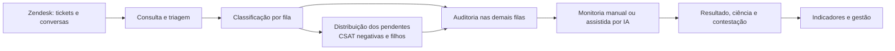
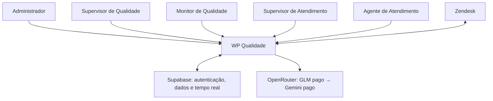

# Ficha Técnica — WP Qualidade

> Levantamento funcional iniciado em 22/09/2026 e atualizado em 23/09/2026. Nome exibido na aplicação: **WP Qualidade** (também apresentado como **QualidadeWP**). Esta ficha descreve a experiência e as regras operacionais observadas; não substitui a documentação do código-fonte.

## Resumo executivo

O WP Qualidade apoia a gestão da qualidade de uma operação de suporte. Ele reúne chamados consultados no Zendesk, organiza a triagem por satisfação e tipo de ticket, distribui parte do trabalho entre monitores disponíveis e permite registrar avaliações estruturadas. A inteligência artificial sugere análises e respostas para critérios da ficha, mas o registro da monitoria e as decisões de contestação continuam no fluxo humano. Indicadores por perfil mostram volume, notas, pendências, tendências e oportunidades de melhoria.

O sistema **não substitui o Zendesk** como origem do atendimento. A distribuição automática confirmada se aplica às filas **CSAT Negativas** e **Chamados Filhos**; as demais filas são consultadas e trabalhadas na Central, mas não seguem essa mesma atribuição individual. O envio de um parecer ao Zendesk é uma ação separada; finalizar a monitoria não publica automaticamente um comentário no ticket.

**Base desta ficha:** navegação de leitura com Playwright na aplicação local, usando as telas dos cinco perfis e as abas de configuração; conferência dos fluxos, testes e commits até `c3af434` (22/09/2026). A navegação local usa dados demonstrativos. A URL pública da Vercel respondeu HTTP 200 em 23/09/2026, mas não foram validados login, versão implantada nem métricas reais de operação. Mudanças locais ainda não versionadas são identificadas separadamente.

## 1. Identificação do sistema

| Item | Identificação |
|---|---|
| Nome | WP Qualidade / QualidadeWP |
| Tipo | Aplicação web de gestão da qualidade do atendimento |
| Finalidade | Triar chamados, apoiar auditorias, acompanhar revisões e apresentar indicadores de qualidade |
| Público-alvo | Monitores e supervisores de qualidade, administradores, supervisores e agentes de atendimento |
| Contexto operacional | Operação de suporte cujos tickets e conversas têm origem no Zendesk |

### Acessos e referências verificadas

| Destino | Link / referência | Alcance da verificação |
|---|---|---|
| Aplicação web (Vercel) | [qualitrack.vercel.app](https://qualitrack.vercel.app/) | Respondeu HTTP 200 em 23/09/2026; autenticação e versão ativa não foram conferidas. |
| Painel Vercel | [Dashboard Vercel](https://vercel.com/dashboard) — projeto local `qualitrack`, ID `prj_kPEZmA7hbCxGMdueKYX4dtQ5YNTU` | O vínculo do projeto consta em `.vercel/project.json`; o acesso ao painel exige conta autorizada. Não foi identificado um deep link de equipe confiável. |
| Projeto Jira | [Board WQ](https://qualityautomacao.atlassian.net/jira/software/projects/WQ/boards/896) e [cartão do projeto WQ-2](https://qualityautomacao.atlassian.net/browse/WQ-2) | Board e cartão confirmados via API do Jira. |
| Código-fonte | [QualiTrack no GitHub](https://github.com/allanscode/QualiTrack) | Remoto `origin` do repositório local; referência publicada desta ficha: commit `c3af434`. |
| Backend | [Projeto Supabase](https://supabase.com/dashboard/project/vpytvgpsqdapgouyjowc) | Migrations `20260922000023`–`24` e função `helpdesk-queue` foram publicadas em 22/09/2026; o painel requer acesso autorizado. |

Esses links não contêm chaves, tokens ou credenciais. O domínio `qualitrack.seudominio.com` citado no plano de deploy é apenas um exemplo e não foi usado como endereço real.

## 2. Introdução

A operação precisa avaliar atendimentos de maneira padronizada, dar visibilidade às insatisfações, evitar concentração do trabalho de triagem e registrar decisões contestáveis e rastreáveis. O WP Qualidade combina formulários de critérios, distribuição de chamados, consulta às evidências do Zendesk, apoio de IA e painéis de acompanhamento.

Seus objetivos específicos são: direcionar amostras relevantes aos monitores; manter a responsabilidade por ticket clara; apoiar a análise sem dispensar revisão humana; calcular notas e prazos segundo parâmetros de qualidade; permitir ciência, contestação e reavaliação; e transformar avaliações em indicadores gerenciais. Os benefícios esperados são maior consistência, menor risco de trabalho duplicado, melhor distribuição de carga e acompanhamento das pendências.

## 3. Escopo do sistema

**Faz:** autenticação e gestão de acesso; consulta paginada de filas e conversas do Zendesk; triagem e identificação de tickets pai/filho; atribuição equilibrada nas filas distribuídas; monitorias manuais ou assistidas por IA; revisão, contestação e escalonamento; acompanhamento de prazos; dashboards; administração de usuários, equipes, formulários, regras operacionais, metas, campos complementares e manuais da IA; publicação opcional de avaliação no Zendesk.

**Não faz, segundo o levantamento:** não é a plataforma de abertura e atendimento original dos tickets; não mantém um espelho integral e permanentemente sincronizado de todos os chamados do Zendesk; não comprova uma métrica formal de cobertura de todos os tickets do mês; não torna obrigatório aceitar o parecer da IA; não envia automaticamente ao Zendesk toda monitoria recém-finalizada. A existência de um receptor de webhook não comprova que gatilhos do Zendesk estejam ativos em produção nem que sejam a fonte das filas.

Áreas visíveis: **Dashboard**, **Monitorias**, **Filas de Triagem** e, conforme o perfil, **Configurações**. O Administrador também dispõe de **Customizar Dashboards**, voltado à edição de descrições explicativas dos indicadores por perfil.

Recursos transversais incluem convite e recuperação de acesso, preferências de aparência, avisos na interface sobre eventos relevantes e consulta do estado de conexão. A área administrativa também permite importar grupos do Zendesk como equipes, mediante ação autorizada.

## 4. Perfis de usuário

| Perfil | Responsabilidade e acesso confirmado |
|---|---|
| **Administrador** | Visão global; gestão de usuários e solicitações de acesso; equipes, formulários, operação, metas, campos extras e central de IA. Pode habilitar monitores na triagem, alterar manualmente o responsável por ticket distribuído e encerrar sessões de outros usuários. |
| **Supervisor de Qualidade** | Acompanha indicadores globais e a operação de qualidade; acessa filas e monitorias. Pode habilitar monitores, alterar responsável por ticket distribuído e encerrar sessões, sujeito às restrições para contas de administrador. Nas Configurações, a interface oferece Equipes, Formulários, Campos Extras e Inteligência Artificial. |
| **Monitor de Qualidade** | Executa monitorias, revisa contestações sob sua responsabilidade e consulta suas atribuições nas filas distribuídas. Acessa Equipes, Formulários, Campos Extras e Inteligência Artificial na interface, conforme permissões de cada ação. Não tem a ação **Alterar monitor** nem a gestão de elegibilidade da fila. |
| **Supervisor de Atendimento** | Acompanha o desempenho das suas equipes e participa das etapas gerenciais de revisão/contestação. Pode consultar a Central de Filas; nas Configurações, vê Equipes em modo de consulta. Não administra a distribuição dos monitores. |
| **Agente de Atendimento** | Consulta as monitorias de seus atendimentos, toma ciência, aceita ou contesta resultados e acompanha seus prazos. Não vê a Central de Filas nem as Configurações. A identidade do monitor é ocultada na visualização destinada ao suporte. |

A visibilidade dos dados também é limitada pelo perfil e pelas equipes vinculadas; a apresentação da interface não é a única barreira de acesso.

## 5. Central de Filas & Triagem

As filas consultam tickets do Zendesk em páginas. Quando uma visualização salva está configurada, ela determina os chamados apresentados; na ausência dessa configuração, a consulta usa critérios de busca equivalentes. Assim, a Central reflete os chamados retornados pela integração, e não uma cópia local de todo o Zendesk.

| Fila | Critério e finalidade observados |
|---|---|
| **CSAT Negativas** | Atendimentos com satisfação ruim ou ruim com comentário. Priorização da insatisfação; pode excluir tickets já validados quando a marcação correspondente estiver configurada. É fila com atribuição individual equilibrada. |
| **Fila Proativa** | Chamados sem avaliação de satisfação oferecida/registrada segundo o critério de busca configurado; apoia amostragem e identificação de oportunidades de auditoria. |
| **CSAT Positivas** | Atendimentos com satisfação boa ou boa com comentário; permite analisar acertos e realizar auditoria assistida por IA. |
| **Chamados Filhos** | Tickets relacionados a outro chamado, identificados pela visualização ou marcações do Zendesk. Permite conferir o filho, acessar a conversa do pai e avaliar sua conformidade. É fila com atribuição individual equilibrada. |
| **Filhos Inválidos** | Chamados filhos sinalizados como fora do padrão ou inconsistentes; a Central exibe a inconformidade e oferece conferência da situação. A marcação da fila não substitui uma decisão humana sobre o caso. |

Os cartões mostram identificação, assunto, atendente, informações de satisfação/categoria, acesso ao Zendesk e data/hora do ticket. Há busca por ID, assunto ou agente, filtros de rascunho de IA, seleção de página, atualização e paginação. Administrador e Supervisor de Qualidade também podem filtrar por **Todos os monitores** ou por um responsável específico, inclusive offline; a quantidade encontrada e o estado vazio acompanham o filtro, sem alterar atribuições. Quando há vínculo pai/filho, a Central mostra o ID relacionado. A identificação do pai usa primeiro o vínculo estruturado disponível e, na falta dele, indícios do assunto ou de campos do ticket; vínculos inferidos devem ser confrontados com o Zendesk em casos ambíguos.

## 6. Distribuição de tickets

Nas filas **CSAT Negativas** e **Chamados Filhos**, o responsável é um monitor de qualidade ativo, habilitado para triagem e com sessão considerada online. A presença e a habilitação são condições distintas: estar logado não basta se o monitor foi retirado da distribuição.

O balanceamento considera a **carga de tickets pendentes já atribuídos** aos monitores elegíveis, inclusive entre essas duas filas. Novos tickets obtidos na sincronização vão para quem tem menor carga. A escolha é determinística, com critérios estáveis de desempate; um simples refresh não deve trocar donos sem necessidade. Quando um segundo monitor entra, apenas o mínimo de tickets automáticos ainda não iniciados é transferido para reduzir a diferença de carga: por exemplo, 2 tickets/2 monitores tendem a 1/1; 5 tickets/2 monitores, a 3/2. Atribuições manuais e trabalhos já iniciados podem justificar diferença maior.

Se o responsável sai ou perde elegibilidade, **tickets pendentes** voltam à redistribuição entre os online; se não houver monitor apto, aguardam disponibilidade. Trabalho em andamento não é movido automaticamente. Administrador e Supervisor de Qualidade podem usar **Alterar monitor**, escolhendo outro monitor elegível e online. A escolha manual permanece prioritária enquanto esse monitor continuar online; se ele sair e o ticket ainda estiver pendente, pode voltar ao balanceamento automático.

Uma troca de ticket já em avaliação exige confirmação. Ela encerra a posse humana anterior e define um único novo responsável; não autoriza dois monitores a atuar simultaneamente. O processamento de IA iniciado para aquele ticket é independente dessa posse e pode continuar até entregar o resultado ao responsável atual.

**Limite operacional:** a atribuição é formada sobre os tickets que a Central efetivamente buscou/sincronizou. Não há confirmação de pré-atribuição instantânea de todos os tickets ainda não paginados do Zendesk.

## 7. Presença e usuários conectados

A aplicação registra periodicamente a sessão autenticada e obtém a lista de usuários considerados online, sem contar múltiplas abas do mesmo usuário como pessoas diferentes. O contador de conectados acompanha essa lista. A identificação não depende apenas de um indicador visual no navegador: sessões sem atualização recente deixam de ser consideradas online.

Login, saída, perda de sessão e retorno à aplicação atualizam a disponibilidade. Alterações de presença podem provocar o rebalanceamento de tickets **pendentes**. Administrador e Supervisor de Qualidade têm ação para encerrar a sessão de outro usuário; a operação revoga as sessões do alvo no serviço de autenticação, encerra sua presença e envia uma instrução de saída às telas abertas. O administrador que executa a ação permanece logado. Em caso de falha, a interface deve mostrar o erro, e não somente esconder a pessoa da lista.

## 8. Auditoria de qualidade

A monitoria pode começar diretamente na área de Monitorias ou a partir de um ticket na Central. A ficha percorre quatro etapas visíveis: **Identificação**, **Avaliação**, **Pesquisa** e **Registro/Log**. Ela reúne dados do ticket, canal, agente, equipe e formulário; respostas aos critérios por pilar; justificativas, eventuais erros críticos; informações de satisfação e contato; e o registro final. A nota é calculada conforme pesos e respostas aplicáveis; um erro crítico marcado pode zerá-la.

A avaliação com IA é **apoio**: pode produzir um rascunho com nota, resumo e sugestões para os critérios, a ser conferido e complementado pelo monitor. O card do ticket apresenta progresso contextual e permite **Interromper análise**; o job mantém no backend uma fase entre `pending`, `running_glm`, `fallback_gemini`, `retry_pending`, `completed`, `cancelled` e `failed`. O resultado de um job em execução continua disponível mesmo se o responsável pelo ticket mudar; a troca não reinicia o job. Há proteção para impedir duas análises de IA simultâneas do mesmo ticket e para manter somente um resultado final válido.

Após salvar, a monitoria segue para ciência/revisão pelo suporte. O agente pode aceitar ou contestar; a Qualidade pode reavaliar ou manter a avaliação; contestações podem subir ao Supervisor de Atendimento e ao Supervisor de Qualidade. Prazos de ação consideram horário comercial e feriados configurados. Se uma etapa expira, há conclusão automática segundo a responsabilidade da etapa, com registro dessa origem no histórico. O sistema mantém o histórico de ações e justificativas.

O parecer pode ser copiado como macro e, quando habilitado, enviado ao Zendesk por uma **ação explícita** de envio. A finalização da monitoria, por si só, não publica automaticamente um comentário no chamado.

## 9. Inteligência artificial

A IA analisa o conteúdo pertinente do atendimento, os critérios da ficha, campos do ticket e, quando selecionados, manuais normativos. Ela sugere respostas justificadas, pontos fortes, melhorias, resumo e nota; há avaliação específica de conformidade para chamados filhos. A aplicação oferece uma área de **Manuais & Padrões**, **Logs & Auditoria** e **Pipeline & Sanitizador**. Alterações em manuais podem passar por proposta e aprovação antes de substituir o conteúdo ativo.

Manuais podem ser cadastrados a partir de arquivos de texto, PDF ou documento do Word, com visualização do conteúdo extraído. Isso fornece referência normativa à análise, sem transformar o documento em decisão automática.

A cadeia implementada em `c3af434` começa obrigatoriamente com **`z-ai/glm-5.3-flash` pago via OpenRouter**, com até quatro tentativas dentro de uma janela total de 30 segundos. Se falhar ou expirar, passa para **`google/gemini-3.8-flash` pago via OpenRouter**, com até três tentativas. O roteamento do OpenRouter permite failover entre providers do mesmo modelo. Não há modelo `:free`, API direta do Google nem fallback para OpenAI nesse fluxo. A chave `OPENROUTER_API_KEY` é lida apenas pela Edge Function; o frontend não seleciona modelo nem recebe a chave.

Timeout, 429, falha 5xx, resposta vazia, JSON inválido, erro de parsing ou resposta incompleta podem levar a nova tentativa com backoff. Erros definitivos de credencial/configuração não são repetidos como falhas transitórias. A resposta estruturada é validada antes do salvamento. Se ambos os modelos falharem de forma recuperável, o **mesmo job permanece pendente na fila automática de reprocessamento**; não é perdido nem duplicado. O cancelamento manual é diferente do timeout: marca `cancelled`, interrompe a tentativa quando possível, bloqueia retries e Gemini, descarta resposta tardia e só permite novo job após o worker confirmar a parada. Logs técnicos registram job, modelo, provider quando disponível, tentativa, duração, status, tokens, custo e ID de geração sem registrar a chave ou o prompt integral.

**Limite de confirmação:** testes locais cobriram falhas e cancelamento simulados, mas a chamada paga real, o consumo exibido na conta OpenRouter e o failover entre providers reais ainda exigem um ambiente E2E isolado; não são afirmados como comprovados em produção.

## 10. Leitura e normalização do atendimento

O Zendesk é a fonte consultada para ticket, comentários, participantes e metadados. A leitura reúne transitoriamente uma representação estruturada do chamado: IDs do ticket e da relação pai/filho quando identificada; solicitante, criador e responsável; equipe/organização quando disponível; usuários e papéis; comentários públicos e notas internas; e horários. Isso funciona como um **snapshot de processamento**, não como uma cópia integral persistente do atendimento.

Mensagens comuns são classificadas pelo identificador e papel do autor fornecidos pelo Zendesk. Transcrições consolidadas de chat são separadas em falas; seus participantes são confrontados com usuários e eventos da conversa do Zendesk. A classificação não depende de exceções pelo nome de uma pessoa. Quando o papel não é resolvido de forma confiável, a interface usa uma categoria neutra em vez de inventar que se trata de cliente. Notas internas são separadas antes da classificação cliente/atendente.

A data de criação do ticket vem do registro original do Zendesk. A interface apresenta data e hora em português do Brasil, no fuso **America/Sao_Paulo**. Comentários da API trazem instante próprio; em transcrições legadas consolidadas, horários individuais extraídos do texto podem não trazer informação explícita de fuso, exigindo conferência no Zendesk quando a precisão minuto a minuto for decisiva.

Antes de enviar conteúdo para IA ou registros auxiliares, o fluxo reduz informações desnecessárias: substitui nomes de participantes por papéis numerados no texto preparado e remove padrões identificáveis como e-mails, documentos, telefones, IPs e segredos explícitos. O histórico bruto continua no Zendesk e é consultado novamente quando necessário. **Essa sanitização é por padrões e não garante anonimização perfeita de todo texto livre**; o acesso aos registros de IA continua sujeito às permissões aplicáveis.

## 11. Visualização da conversa

Na Central, o usuário pode abrir a conversa do filho e alternar para a do pai quando houver vínculo. Na ficha de monitoria, há painel de evidências para consultar o diálogo durante a avaliação. A visualização apresenta autor, categoria, conteúdo e data/hora, com busca por termo e contadores nas abas **Todas**, **Cliente**, **Atendente** e **Internas**; na ficha, mensagens de **Bot/IA** também podem ter aba própria quando presentes.

Os contadores derivam da mesma classificação usada para filtrar as mensagens. Assim, um comentário interno não é contado como mensagem pública do cliente ou do atendente. Eventos de sistema e papéis não resolvidos continuam acessíveis em **Todas**, sem serem rotulados artificialmente como cliente.

## 12. Dashboards e indicadores

Cada perfil vê um painel adequado à sua responsabilidade e aos dados que pode consultar. Os filtros visíveis incluem período, equipe, status e, conforme o perfil, agente e monitor; existe atualização dos dados. Os indicadores são construídos a partir das monitorias e suas etapas, não representam necessariamente todos os tickets existentes no Zendesk.

| Perspectiva | Indicadores e finalidade gerencial |
|---|---|
| **Agente de Atendimento** | Média individual e da equipe, volume, pendências, contestações aprovadas/recusadas e taxa de sucesso; evolução, prazos, principais critérios perdidos, classificação por faixas, insatisfação e auditorias recentes. Permite entender desempenho e ações devidas. |
| **Monitor de Qualidade** | Volume próprio, pendências, notas médias, reavaliações e taxa de reversão; volumetria diária, trabalhos em andamento, ações expirando, falhas por critério, distribuição por equipe, curva de qualidade, precisão e auditorias recentes. Apoia produtividade e consistência. |
| **Supervisor de Atendimento** | Médias, excelência, totais/pendências, tendência, reavaliações, usuários online, histórico e rankings de melhores resultados e pontos de atenção; insatisfação e critérios ofensores. Apoia a gestão das equipes vinculadas. |
| **Supervisor de Qualidade e Administrador** | Visão ampla de média geral, excelência, volume, pendências, usuários online, tendência, reavaliações, taxa de reversão, precisão, insatisfação, desempenho histórico, rankings de agentes e volume por monitor. Apoia capacidade, calibragem e governança da qualidade. |

As faixas de classificação, metas e prazos são parametrizáveis. O Administrador pode editar as descrições explicativas dos blocos do dashboard por perfil; essa personalização não deve ser confundida com alteração dos dados ou das fórmulas dos indicadores.

## 13. Integrações e recursos utilizados

| Recurso / Serviço | Utilização no WP Qualidade |
|---|---|
| **Zendesk — Tickets, Views, Search, Comments e Conversation Log** | Origem dos chamados, satisfação, participantes, histórico, vínculos e campos; abertura do ticket original a partir da interface. |
| **Zendesk — publicação de comentário** | Destino opcional de parecer enviado por ação específica, separado do salvamento da monitoria. |
| **Supabase Auth** | Login, recuperação/convite e gestão das sessões autenticadas. |
| **Supabase PostgreSQL** | Persistência de monitorias, formulários, usuários, configurações, presença, atribuições, jobs e registros de auditoria. |
| **Supabase Realtime** | Propagação de alterações relevantes, como atribuições, resultados da IA e comandos de encerramento de sessão. |
| **Supabase Edge Functions** | Intermediação protegida com o Zendesk, avaliação com IA, ações administrativas e publicação opcional. |
| **OpenRouter** | Gateway único da IA: GLM 5.3 Flash pago como principal e Gemini 3.8 Flash pago como contingência; credencial exclusiva da Edge Function. |
| **SMTP** | Envio de mensagens transacionais relacionadas a acesso quando configurado para o ambiente. O provedor SMTP efetivo não foi confirmado. |

O frontend possui vínculo local com o projeto Vercel `qualitrack` e a URL pública respondeu HTTP 200; isso não prova que todos os fluxos funcionem na versão publicada. As migrations e a Edge Function da cadeia de IA foram publicadas no projeto Supabase identificado acima. O receptor de webhook do Zendesk existe, porém sua ativação por gatilhos externos não foi confirmada; ele não foi tratado como origem comprovada das filas.

## 14. Metodologia operacional

1. **Entrada:** a Central consulta páginas de tickets do Zendesk, por visualizações configuradas ou critérios de busca.
2. **Triagem:** agrupa por satisfação e marcadores de chamados filhos; mostra contexto e identifica relações pai/filho quando possível.
3. **Distribuição:** nas duas filas distribuídas, registra um monitor apto por ticket e ajusta apenas trabalho pendente quando a presença muda.
4. **Auditoria:** o monitor confronta a conversa e os campos do Zendesk com os critérios da ficha; pode pedir um rascunho de IA.
5. **Resultado:** a monitoria salva gera nota, justificativas e histórico; segue para ciência, eventual contestação, reavaliação e decisão final.
6. **Gestão:** dashboards e configurações orientam metas, prazos, acompanhamento e calibragem.

### Atores e serviços

## 15. Principais regras de negócio

| Regra | Efeito operacional |
|---|---|
| Elegibilidade | Somente monitor de qualidade ativo, habilitado e online recebe atribuição automática. |
| Equilíbrio | Considera a carga pendente, escolhe menor carga e evita movimentação aleatória; mudanças de presença movem apenas o mínimo necessário de trabalho automático ainda não iniciado. |
| Prioridade manual | A escolha de Administrador/Supervisor de Qualidade persiste enquanto o monitor escolhido permanecer apto e online. |
| Saída do responsável | Ticket manual ou automático **pendente** pode voltar ao balanceamento; trabalho em andamento não muda automaticamente. |
| Concorrência humana | Um ticket distribuído tem um responsável por vez; iniciar a avaliação e transferir a posse passam por verificação de exclusividade. |
| Transferência em andamento | Requer confirmação e encerra a posse anterior; não interrompe automaticamente um job de IA já iniciado. |
| IA por ticket | Um job ativo por ticket; tentativas/fallback compõem um único processamento e só um resultado válido final é salvo. Cancelamento manual persiste no backend e impede fallback/retry; novo job aguarda a confirmação de parada do worker. |
| Ticket pai/filho | Relação estruturada tem prioridade; inferências secundárias exigem cuidado quando o vínculo é ambíguo. |
| Classificação de mensagens | Papel vem dos participantes/eventos do Zendesk; notas internas ficam separadas e papel incerto não vira “Cliente” por presunção. |
| Avaliação e prazo | Critérios e pesos produzem a nota; erros críticos podem zerá-la; prazos seguem horário comercial/feriados e podem ser concluídos automaticamente ao vencer. |
| Contestação | Suporte pode discordar; Qualidade reavalia; instâncias gerenciais decidem escalonamentos, com histórico. |

## 16. Falhas e contingência

| Situação | Comportamento identificado |
|---|---|
| Zendesk indisponível ou credenciais ausentes | A consulta falha de forma visível; não há base local completa que substitua os tickets. Quando não há visualização salva configurada, pode ser usada a busca do Zendesk. |
| Ticket sem vínculo ou autor confiável | O sistema usa campos alternativos para sugerir pai/filho; papel de participante incerto fica neutro, sem correção por nome. |
| Ticket inválido/inconsistente | Permanece destacado na fila correspondente para conferência; a marcação não constitui decisão conclusiva. |
| IA lenta, limitada ou indisponível | Tenta primeiro o GLM pago com failover/retries; após falha ou limite total de 30 segundos, tenta o Gemini pago. Se ambos falharem de modo recuperável, mantém o job na fila automática de reprocessamento; erro definitivo de configuração é apresentado. |
| Concorrência ou repetição de clique | Exclusividade de atribuição e de job impede atuação simultânea ou avaliações de IA duplicadas para o mesmo ticket. |
| Sessão expirada/desconectada | A aplicação verifica a autenticação e renova presença quando possível; ausência prolongada retira o usuário da lista online e pode redistribuir seus tickets pendentes. |
| Encerramento administrativo malsucedido | O erro deve ser apresentado; não se considera encerrada a sessão apenas porque o usuário sumiu temporariamente da interface. |

## 17. Segurança, governança e limites de confirmação

O acesso é condicionado a perfil, vínculo de equipe e políticas de leitura/escrita dos dados. Operações sensíveis, como transferir tickets, concluir jobs de IA e encerrar sessões alheias, exigem validação no serviço, não apenas ocultação de botões. O suporte não recebe a identidade pessoal do avaliador em suas visões de monitoria. Histórico de ações, registros de execução da IA e estados de atribuição permitem rastrear decisões; esses registros também exigem controle de acesso por conterem informações operacionais.

O sistema faz minimização e sanitização antes do processamento de IA, mas textos livres podem conter dados sensíveis não capturados por regras automáticas. A consulta ao ticket completo deve ficar restrita a perfis autorizados. O código e a implantação da Edge Function indicam a cadeia paga GLM → Gemini; **não** foram comprovados nesta ficha consumo real no OpenRouter, provider efetivo de uma avaliação real, login na versão pública, gatilhos externos do webhook, provedor SMTP e aderência operacional de todos os tickets da base Zendesk. Chaves e valores de credenciais não integram este documento.

## 18. Fluxo resumido para quem nunca utilizou

O Zendesk guarda os atendimentos. O WP Qualidade busca os chamados relevantes, separa-os em filas e, em duas delas, entrega os pendentes de forma equilibrada aos monitores disponíveis. O monitor lê a conversa, avalia os critérios da ficha e pode usar IA para preparar sugestões. Depois de salvar, o agente de atendimento toma ciência e pode contestar; supervisores acompanham decisões, prazos e resultados nos dashboards.

## 19. Resumo técnico

| Item | Descrição |
|---|---|
| **Sistema** | WP Qualidade / QualidadeWP |
| **Objetivo principal** | Padronizar e acompanhar auditorias de qualidade em atendimentos de suporte |
| **Usuários** | Administrador, Supervisor de Qualidade, Monitor de Qualidade, Supervisor de Atendimento e Agente de Atendimento |
| **Origem dos chamados** | Zendesk, consultado por visualizações ou busca e enriquecido com comentários e participantes |
| **Método de distribuição** | Balanceamento determinístico da carga pendente entre monitores habilitados e online, nas filas CSAT Negativas e Chamados Filhos, com transferência manual prioritária |
| **Auditoria** | Ficha estruturada, cálculo de nota, revisão humana, contestação, prazos e histórico |
| **Uso de IA** | Rascunho analítico validado; GLM pago → Gemini pago via OpenRouter, retries, cancelamento persistente e fila automática; um job por ticket |
| **Integrações** | Zendesk, Supabase Auth/PostgreSQL/Realtime/Edge Functions, OpenRouter e SMTP configurável |
| **Resultado esperado** | Distribuição mais justa, avaliações consistentes e rastreáveis e indicadores úteis à operação de qualidade |

## 20. Progresso técnico — corte de 23/09/2026

O quadro abaixo separa **implementação no repositório** de **validação operacional**. “Publicado” para o backend indica migrations/Edge Function aplicadas; não equivale a aprovação de todos os cenários em produção.

| Frente | Entrega/evidência | Estado e próximo gate |
|---|---|---|
| Distribuição e presença | Balanceamento determinístico, entrada/saída de monitores, transferência manual e proteção da atribuição (`f37187b` a `dc15252`). | Implementado e testado em banco/UI. [WQ-1](https://qualityautomacao.atlassian.net/browse/WQ-1) relata erro de transferência em 23/09 e permanece **aberto para reprodução e diagnóstico**; não presumir resolvido pelos testes anteriores. |
| Sessões remotas | Revogação efetiva da sessão de outro usuário, preservando a do administrador (`33d9e63` e testes subsequentes). | Implementado; manter monitoramento operacional e repetir teste autenticado após alterações de Auth. |
| Dados do Zendesk | Classificação cliente/agente/interna por autor/papel e data/hora do ticket (`5046db4`). | Implementado; comparação de casos reais com Zendesk continua sendo critério de aceite operacional. |
| IA e concorrência | GLM pago → Gemini pago via OpenRouter, reprocessamento, fases e cancelamento durável (`2d0f64d`, `c3af434`; migrations `20260922000023`–`24`). | Backend publicado; testes simulados passaram. **Pendente** execução paga ponta a ponta e comprovação de provider/custo no OpenRouter em staging isolado. |
| Segurança | RLS/RPC/Edge Functions endurecidas e testes de manipulação de requests (`36b6901` a `617fa27`). | Correções publicadas e documentadas; ver [auditoria detalhada](https://github.com/allanscode/QualiTrack/blob/c3af434/docs/security/audit-2026-09-22.md). Rotação das credenciais anteriormente expostas e decisões sobre retenção histórica continuam ações operacionais. |
| Experiência da Central | Filtro por monitor, progresso da IA no card e painel compacto de monitores (`36b6901`, `617fa27`). | Implementado e validado com Playwright em larguras diferentes; conferir novamente a versão efetiva da Vercel com usuário autorizado. |
| Seleção manual de ficha/manual na IA | Alterações locais de 23/09 em frontend, Edge Function e migration `20260923000001`. | **Em desenvolvimento local neste corte:** sem commit/deploy/validação concluída nesta ficha; não contar como entrega publicada. |

Os testes de 22/09 registraram lint, build, 147 testes de aplicação, 36 testes de banco e 14 cenários Playwright aprovados; quatro cenários live foram ignorados por exigirem staging isolado. Esses números pertencem ao commit `c3af434`, **não** validam automaticamente as mudanças locais posteriores.
