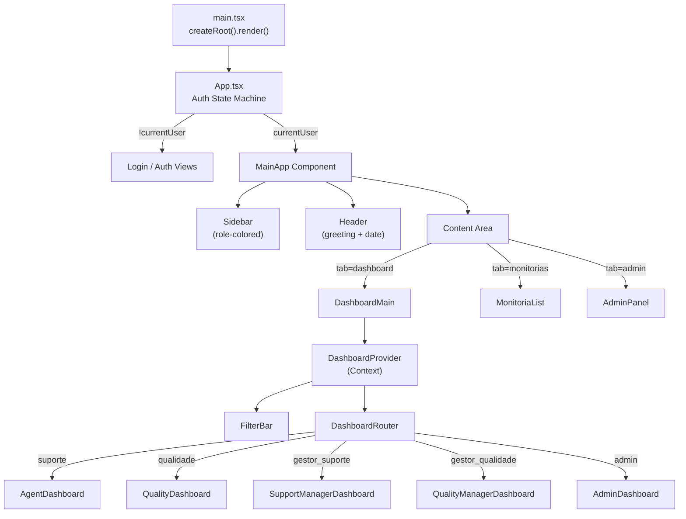

# Arquitetura Frontend

## Stack

| Tecnologia | Versão | Propósito |
|---|---|---|
| React | 19.x | UI Framework |
| TypeScript | ~5.8 | Tipagem estática |
| Vite | 6.x | Bundler + Dev Server |
| TailwindCSS | 4.x | Utility-first CSS |
| Motion | 12.x | Animações (Framer Motion) |
| Recharts | 3.x | Gráficos de dashboard |
| Lucide React | 0.546 | Ícones SVG |
| Sonner | 2.x | Toast notifications |
| date-fns | — | Formatação de datas (locale pt-BR) |
| clsx + tailwind-merge | — | Merge condicional de classes |

## Estrutura de Pastas

```
src/
├── App.tsx                    # Entry point: Auth + Layout + Tab Navigation
├── main.tsx                   # React DOM render
├── index.css                  # Design tokens + CSS global
├── types.ts                   # Tipos TypeScript globais
├── lib/
│   ├── supabase.ts            # Cliente Supabase + MockDB (localStorage)
│   ├── useQualityConfig.ts    # Hook de configuração de qualidade
│   └── businessHours.ts       # Utilitários de horário comercial/SLA
├── utils/                     # (Vazio — não utilizado atualmente)
└── components/
    ├── AdminPanel.tsx          # Painel administrativo (1192 linhas)
    ├── MonitoriaForm.tsx       # Formulário de monitoria multi-step (684 linhas)
    ├── MonitoriaList.tsx       # Lista de monitorias com ações (676 linhas)
    ├── QualityConfigManagement.tsx # Config de qualidade/SLA (350 linhas)
    ├── ui/                    # Componentes UI reutilizáveis
    │   ├── Badge.tsx
    │   ├── Button.tsx
    │   ├── Card.tsx
    │   ├── CustomSelect.tsx    # Select dropdown customizado
    │   ├── Select.tsx          # Select nativo estilizado
    │   └── SLAClock.tsx        # Relógio de SLA com contagem regressiva
    └── dashboard/
        ├── DashboardMain.tsx   # Router de dashboard por role
        ├── DashboardContext.tsx # Context Provider com dados e filtros
        ├── FilterBar.tsx       # Barra de filtros global
        ├── roles/             # Dashboards específicos por perfil
        │   ├── AdminDashboard.tsx
        │   ├── AgentDashboard.tsx
        │   ├── QualityDashboard.tsx
        │   ├── QualityManagerDashboard.tsx
        │   └── SupportManagerDashboard.tsx
        └── widgets/           # Componentes de visualização reutilizáveis
            ├── ComparativeBarChart.tsx
            ├── DistributionChart.tsx
            ├── OfensoresChart.tsx
            ├── RankingWidget.tsx
            ├── RecentAuditsTable.tsx
            ├── SlaWidget.tsx
            ├── StatCard.tsx
            └── TrendChart.tsx
```

## Gerenciamento de Estado

QualiTrack **não usa** nenhuma biblioteca de estado global (Redux, Zustand, etc). O estado é gerenciado em dois níveis:

### 1. Estado de Aplicação (`App.tsx`)
Estado raiz que controla:
- `currentUser` — Sessão Supabase Auth ativa
- `userData` — Dados do usuário da tabela `users`
- `activeTab` — Tab ativa (`dashboard` | `monitorias` | `admin`)
- `isDarkMode` — Tema claro/escuro
- `isFormOpen` — Modal de nova monitoria
- `authView` — View de autenticação (`login` | `request-access` | `pending` | etc.)

### 2. Estado do Dashboard (`DashboardContext.tsx`)
Context Provider que centraliza:
- `filters` — Filtros globais (data, equipe, agente, auditor, status, canal)
- `monitorias` — Lista filtrada de monitorias (pós-RBAC + filtros UI)
- `allMonitorias` — Lista completa pós-RBAC (antes de filtros UI)
- `users`, `teams`, `forms` — Dados de referência
- `globalAvg` — Média global de score
- `loading`, `refresh` — Controle de loading e refresh

### 3. Estado Local (Componentes)
Cada componente major (AdminPanel, MonitoriaForm, MonitoriaList) mantém seu próprio estado local via `useState`.

## Navegação / Roteamento

**Não há router library** (React Router, etc). A navegação é controlada por:

```
App.tsx (activeTab state)
├── 'dashboard' → DashboardMain → DashboardRouter (switch por role)
├── 'monitorias' → MonitoriaList
└── 'admin' → AdminPanel (apenas para role='admin')
```

- Dentro de `AdminPanel`, sub-tabs: `users` | `teams` | `forms` | `requests` | `qualidade`
- Dentro de `DashboardMain`, roteamento automático por `user.role`

> **Consequência**: Não há URLs distintas, deep-linking ou browser history. Toda navegação reseta ao recarregar a página.

## Design System

### Tokens (CSS Custom Properties)

Definidos em `src/index.css`, com variantes light/dark:

| Token | Light | Dark | Uso |
|-------|-------|------|-----|
| `--brand-primary` | `#2D3A3A` | `#F9F9F6` | Texto principal |
| `--brand-accent` | `#8E9B7B` | `#8E9B7B` | Accent/CTA |
| `--brand-muted` | `#7A7D71` | `#A3A69A` | Texto secundário |
| `--surface-bg` | `#F9F9F6` | `#1A1C16` | Background geral |
| `--surface-card` | `#FFFFFF` | `#252820` | Background de cards |
| `--surface-border` | `#E2E4D8` | `#3D4136` | Bordas |

### Mapeamento de Perfis (`ROLE_LABELS`)
Os perfis de usuário (roles) são mapeados de IDs técnicos para nomes amigáveis em `src/types.ts`:
- `admin` ➔ **Administrador**
- `qualidade` ➔ **Monitor de Qualidade**
- `gestor_qualidade` ➔ **Supervisor de Qualidade**
- `gestor_suporte` ➔ **Supervisor de Atendimento**
- `suporte` ➔ **Agente de Atendimento**

### Padrões de Layout e Animação
- **Sidebar Dinâmica:** Largura variável (80px recolhida / 260px aberta) controlada por `motion.aside`.
- **Sincronização de Texto:** Rótulos dos menus e seção de perfil utilizam contêineres com `overflow-hidden` e transições de `max-width` sincronizadas em 300ms para evitar transbordo durante a animação.
- **Perfil do Usuário:** Seção de perfil (`profile-toggle-btn`) utiliza `layout` animation do Framer Motion para alternar entre `flex-row` (aberta) e `flex-col` (recolhida), permitindo que o botão de logout fique abaixo do ícone no modo compacto.
- **Quebra de Texto:** Nomes e cargos suportam `break-words` para evitar quebra de layout com nomes extensos.

### Cores Funcionais (fixas)

| Nome | Cor | Uso |
|------|-----|-----|
| success | `#10B981` | Ações positivas, aprovações |
| warning | `#F59E0B` | Alertas, pendências |
| error | `#EF4444` | Erros, rejeições, exclusões |
| info | `#6366F1` | Informações, status intermediários |

### Tipografia
- **Fonte**: Inter (Google Fonts) com fallback para system-ui
- **Pesos usados**: 400, 500, 600, 700, 800, 900

### Padrões UI Recorrentes
- **Cards**: `rounded-3xl` ou `rounded-[32px]` com `border border-surface-border shadow-premium`
- **Botões**: `rounded-2xl` com `font-black uppercase tracking-widest`
- **Inputs**: `rounded-2xl` com `bg-surface-subtle border border-surface-border`
- **Labels**: `text-[10px] font-black uppercase tracking-widest text-brand-muted`
- **Modais**: `fixed inset-0 bg-black/40 backdrop-blur-sm` com card central
- **Animações**: `motion/react` para enter/exit de componentes

## Componentes UI (`src/components/ui/`)

| Componente | Descrição |
|---|---|
| `Card` | Container com padding, borda e shadow |
| `Button` | Botão com variantes: primary, secondary, outline, ghost |
| `Badge` | Tag com variantes: success, error, warning, info, neutral |
| `Select` | `<select>` nativo estilizado |
| `CustomSelect` | Dropdown customizado com portal (evita clipping) |
| `SLAClock` | Relógio de contagem regressiva de SLA |

## Fluxo de Renderização


