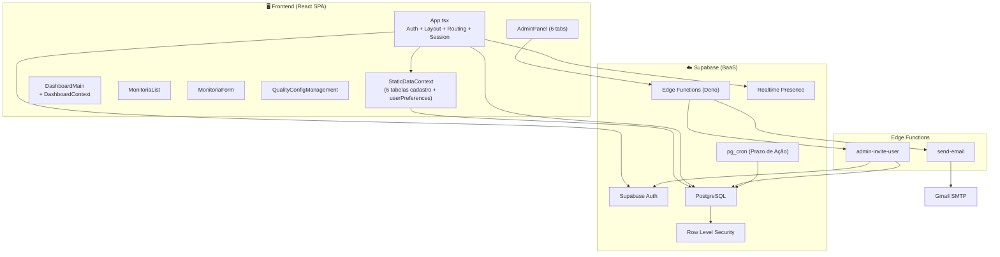
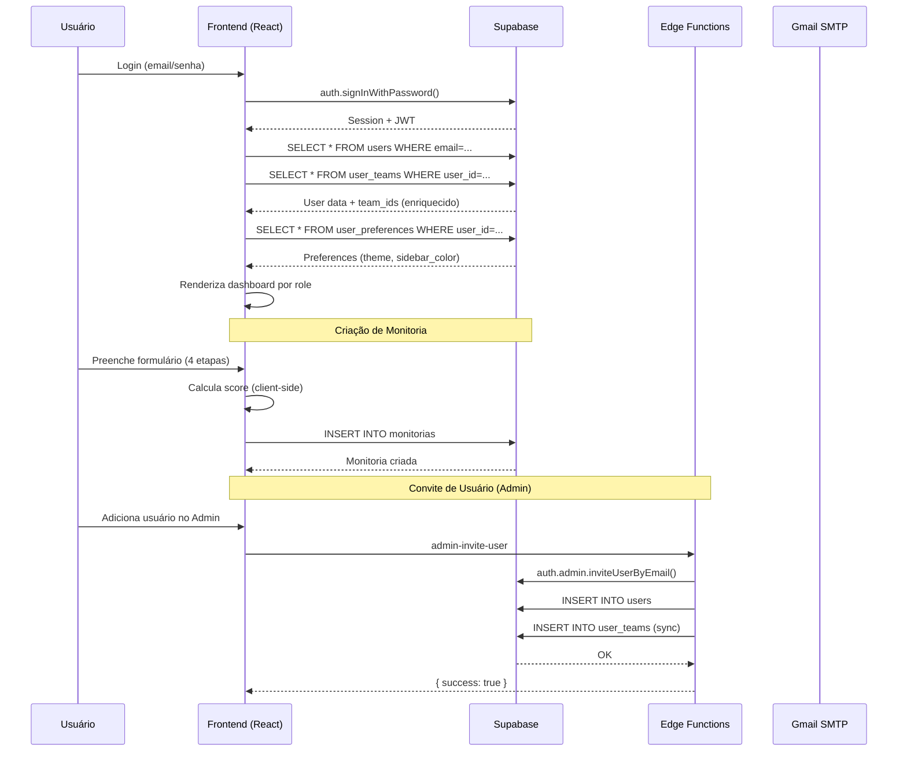

# Arquitetura do Sistema — Visão Geral

## Resumo

QualiTrack é uma **SPA monolítica** (Single Page Application) que se comunica diretamente com o **Supabase** como Backend-as-a-Service. Não existe servidor backend customizado — toda a lógica de negócio está no frontend (React) ou em **Edge Functions** do Supabase (Deno).

## Diagrama de Arquitetura Geral

## Módulos Principais

### 1. Autenticação (`App.tsx`)
- Login com email/senha via Supabase Auth
- Recuperação de senha (hash `type=recovery`)
- Fluxo de convite (hash `type=invite`, detectado por `isInviteFlowRef`)
- Solicitação de acesso (self-service)
- Mock mode com localStorage
- Gerenciamento de sessão unificado: idle timeout (60min), idle warning (5min countdown), absolute timeout (8h), proactive refresh (50min)
- Ref-bridge pattern para `extendSession` (useCallback não pode ser chamado dentro de useEffect)
- `handleLogout({ silent?, message? })` — aceita options para evitar crash com MouseEvent no Sonner
- Sidebar com popover accordion (4 seções recolhíveis: Equipes, Avatar, Aparência, Cor do Menu; single-open via `sidebarAccordion`)
- Sidebar contrast dinâmico via `isDarkColor()` (YIQ luminance) — função no escopo do módulo, variantes derivadas em `MainApp`
- Profile toggle com classe `profile-toggle-btn` para exclusão do click-outside handler
- `scrollbar-gutter: stable` no container de scroll principal para evitar layout shift

### 2. Monitorias (`MonitoriaForm.tsx` + `MonitoriaList.tsx`)
- Criação de auditorias em 4 etapas (stepper)
- Seleção Agente↔Equipe com vinculação protegida (nunca limpa automaticamente; bloqueia troca incompatível com toast)
- CustomSelect com type-ahead (filtro por digitação sem campo de busca)
- Cálculo automático de score com pesos
- Erro crítico zera nota (0%)
- Fluxo de contestação multi-etapa
- Controle de prazos de ação com horário comercial
- Conclusão automática por cron (`resolution_type: 'automatic'`, indicador visual Clock)
- Histórico completo de ações (audit trail)
- `form_snapshot` e `applied_config` salvos no momento da avaliação

### 3. Dashboard (`dashboard/`)
- Context Provider centralizado (`DashboardContext`) — RBAC, filtros, dados, presença online
- Dados de cadastro via `useStaticData()` (não faz fetch próprio de users/teams/forms)
- `userPreferences` via `useStaticData().userPreferences` (não faz fetch independente)
- Roteamento por role (5 dashboards diferentes)
- Filtros globais (data, equipe, agente, auditor, status, canal) — debounced 300ms
- Widgets reutilizáveis com ícones padronizados por categoria semântica
- `getIconBg()` mapeia accent→bg automaticamente
- Cores de gráfico via `chartColors.ts` (lê CSS vars, theme-aware)
- Realtime subscription no canal `monitorias-realtime-dash`

### 4. Administração (`AdminPanel.tsx`)
- 6 sub-tabs: Usuários, Equipes, Formulários, Solicitações, Configurações, Campos Extras
- CRUD de Usuários com convite via Edge Function + `syncUserTeams()`
- CRUD de Equipes
- Editor de Formulários de Avaliação (pilares + pesos + erros críticos)
- Gestão de Solicitações de Acesso
- Configurações de Qualidade
- Campos de Insatisfação (DissatisfactionFields)

### 5. Configurações de Qualidade (`QualityConfigManagement.tsx` + `useQualityConfig.tsx`)
- Context Provider singleton (1 fetch, consumido via `useQualityConfig()`)
- Faixas de classificação (Excelente, Aceitável, Ruim) com cores pastel no dark mode
- Meta de desempenho (target score)
- Prazo de ação por etapa do fluxo (horas úteis)
- Horário comercial e feriados
- Recálculo automático de deadlines ao alterar configuração

### 6. Dados Estáticos / Cadastro (`StaticDataContext.tsx`)
- Context Provider singleton que envolve `<MainApp>` — 1 fetch paralelo de 6 tabelas
- Tabelas: `users`, `teams`, `forms`, `dissatisfaction_fields`, `user_teams`, `user_preferences`
- `enrichUsersWithTeams()` centralizado (elimina 4 cópias anteriores)
- `userPreferences` mapeado e injetado em `User.preferences`
- Travas contra fetch storms: `fetchingRef` + `fetchedRef`
- `refreshAll()` manual — dados estáticos nunca auto-recarregam

### 7. Preferências de Usuário (`user_preferences`)
- Tabela JSONB — fonte de verdade para tema, cor do sidebar, avatar (futuro)
- Leitura: `handleUserSession()` consulta `user_preferences` **antes** de renderizar `MainApp` → resolve `theme` + `sidebar_color` → `setAppReady(true)` (double barrier). `StaticDataContext` faz fetch paralelo para consumo geral dos componentes — nenhum componente faz fetch independente
- Escrita via `upsertUserPreferences()` — apenas em ação explícita do usuário
- `lastDbThemeRef` (module-level) — guard contra auto-save loop (write-back do valor lido do banco)
- `localStorage` como cache instantâneo (evita flash no F5). `qualitrack_theme` é setado como `'system'` no logout (nunca removido) — `index.html` blocking script faz fallback para OS
- `appReady` double barrier — `MainApp` só renderiza após tema + sidebar_color resolvidos. Login fresco: `appReady=false` até DB responder. F5: `appReady=true` (cache)
- Logout curtain pattern — spinner cobre transição visual de tema, sem flash
- `prefetchedSidebarColor` — sidebar nasce com a cor correta extraída do DB no login

## Bounded Contexts

```mermaid
graph LR
    subgraph Auth ["Autenticação"]
        Login
        Register["Solicitação de Acesso"]
        Recovery["Recuperação de Senha"]
        Invite["Convite Admin"]
    end

    subgraph Quality ["Qualidade"]
        Forms["Formulários"]
        Monitoria["Monitorias"]
        Score["Cálculo de Score"]
        ActionDeadline["Controle de Prazo de Ação"]
    end

    subgraph Analytics ["Análise"]
        Dashboards
        Filters["Filtros"]
        Rankings
        Charts["Gráficos"]
    end

    subgraph Admin ["Administração"]
        Users["Usuários"]
        Teams["Equipes"]
        Config["Configurações"]
        AccessReq["Solicitações"]
        Dissatisfaction["Campos de Insatisfação"]
    end

    Auth --> Quality
    Quality --> Analytics
    Admin --> Auth
    Admin --> Quality
```

## Comunicação entre Módulos

| Origem | Destino | Mecanismo | Descrição |
|--------|---------|-----------|-----------|
| App → StaticDataContext | DB | 1 fetch paralelo (6 tabelas) | Cadastro + preferências |
| StaticDataContext → DashboardContext | Context | `useStaticData()` | Users, teams, forms, prefs |
| StaticDataContext → MonitoriaList | Context | `useStaticData()` | Users, teams, forms |
| StaticDataContext → AdminPanel | Context | `useStaticData()` | Users, teams, forms |
| StaticDataContext → MainApp | Context | `useStaticData()` | Teams, userPreferences |
| App → Dashboard | Props + Context | `DashboardProvider` recebe `user`, provê dados filtrados | |
| App → MonitoriaList | Props | `user` e callback `onNew` | |
| App → AdminPanel | Props | `user` | |
| MonitoriaList → MonitoriaForm | State | `viewingMonitoria` renderiza o form inline | |
| AdminPanel → Edge Functions | HTTP | `supabase.functions.invoke()` | |
| DashboardContext → Widgets | Context | `useDashboard()` hook | |
| QualityConfigProvider → Todos | Context | Config compartilhada via Context Provider (1 fetch, consumido via `useQualityConfig()`) | |
| Custom Events | Múltiplos | `qualitrack:reconnected` | Reload após reconexão |

## Padrões Arquiteturais Observados

### ✅ Padrões Positivos
1. **Dual-mode persistence** — Mock (localStorage) + Supabase (produção)
2. **Role-Based Access Control (RBAC)** — 5 perfis com visibilidade diferenciada
3. **Context Providers** — Estado centralizado: cadastro (`StaticDataContext`), dashboard (`DashboardContext`), config (`QualityConfigProvider`)
4. **Design Tokens** — CSS custom properties para temas (light/dark) com cores pastel no dark + `--date-color-scheme` para date inputs
5. **Component composition** — UI components reutilizáveis (Card, Button, Badge, CustomSelect, etc.)
6. **Business hours action deadline** — Cálculo preciso de prazos com feriados
7. **Ref-bridge pattern** — Solução robusta para hooks dentro de useEffect
8. **Semantic icon categories** — Dashboard com ícones padronizados por categoria
9. **`getIconBg()` map** — Deriva automaticamente bg do accent color
10. **Online presence** — Merge local (localStorage) + Supabase Presence, deduplicado por user ID
11. **StaticDataContext centralizado** — 1 fetch paralelo de 6 tabelas cadastro, `enrichUsersWithTeams()` centralizado, elimina fetches independentes
12. **Fetch storm guards** — `fetchingRef` em StaticDataContext, DashboardContext e MonitoriaList; `lastDbThemeRef` contra auto-save loop
13. **UserPreferences DB-backed** — Tabela `user_preferences` (JSONB) como fonte de verdade; `localStorage` como cache instantâneo; escrita apenas em ação explícita do usuário
14. **`appReady` double barrier** — `MainApp` só renderiza após tema + sidebar_color resolvidos do DB; logout curtain pattern previne dark flash visual

### ⚠️ Trade-offs e Limitações
1. **Sem routing library** — Navegação por estado (`activeTab`), sem URLs
2. **Lógica de negócio no frontend** — Cálculo de score, prazos de ação, RBAC no client-side
3. **Componentes grandes** — `App.tsx` (1344 linhas), `MonitoriaForm.tsx` (684 linhas), `MonitoriaList.tsx` (676 linhas)
4. **Sem testes automatizados** — Nenhum framework de teste configurado
5. **Sem CI/CD** — Nenhum pipeline configurado

## Decisões Arquiteturais Chave

| Decisão | Contexto | Consequência |
|---------|----------|-------------|
| Supabase como BaaS | Necessidade de Auth + DB + Serverless sem backend próprio | Lock-in no Supabase, mas desenvolvimento rápido |
| Mock mode | Permitir desenvolvimento offline e demos | Duplicação de lógica mock/real em todo CRUD |
| SPA sem router | Simplicidade inicial | Impossibilidade de deep-linking, SEO |
| TailwindCSS v4 | Design system moderno com CSS custom properties | Exige conhecimento de Tailwind v4 (breaking changes) |
| Edge Functions (Deno) | Operações admin que requerem service role key | Dependência de Deno runtime no Supabase |
| RBAC no client | Controle fino de visibilidade de dados | Segurança depende de RLS no banco para ser efetiva |
| `user_teams` N:N | Relacionamento multi-equipe por usuário | Exige `enrichUserWithTeamIds()` em toda carga de dados |
| `SECURITY DEFINER` para RLS | Evitar recursão infinita (42P17) na policy de `users` | Função `is_admin_user()` bypassa RLS intencionalmente |

## Fluxo de Dados Principal

