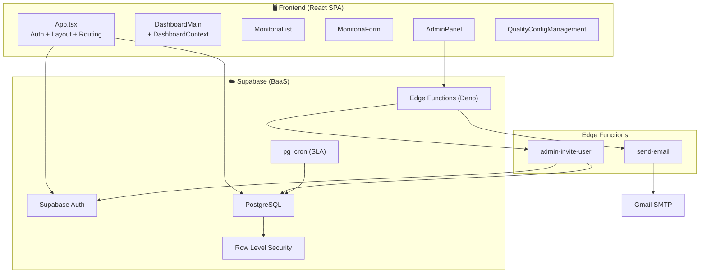
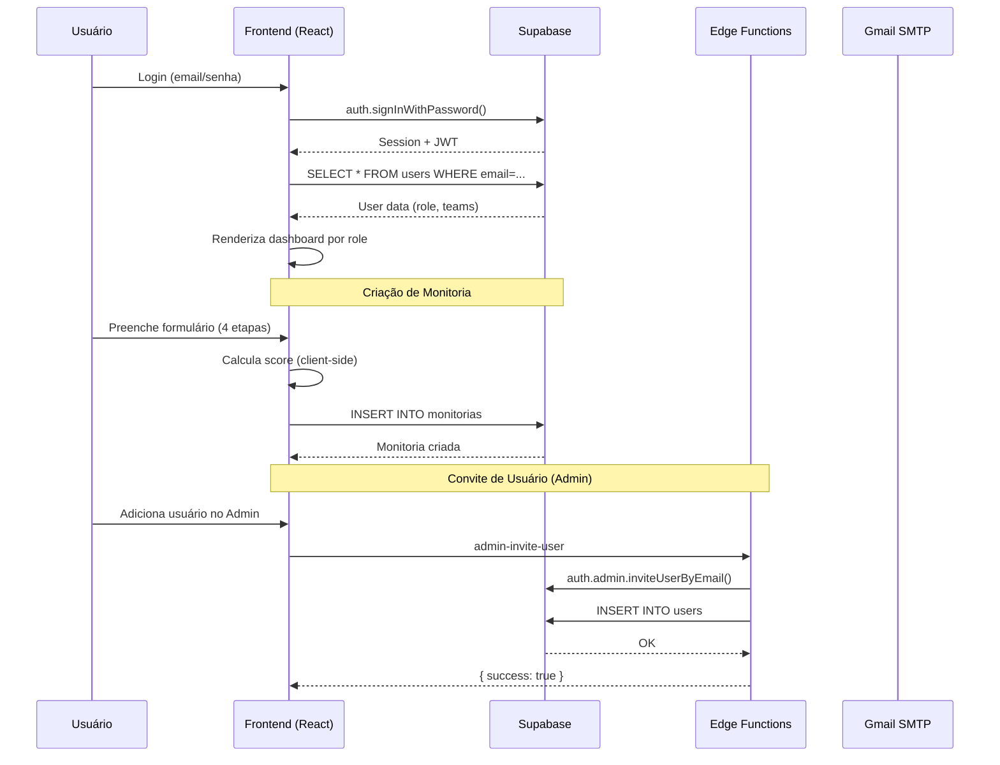

# Arquitetura do Sistema — Visão Geral

## Resumo

QualiTrack é uma **SPA monolítica** (Single Page Application) que se comunica diretamente com o **Supabase** como Backend-as-a-Service. Não existe servidor backend customizado — toda a lógica de negócio está no frontend (React) ou em **Edge Functions** do Supabase (Deno).

## Diagrama de Arquitetura Geral

## Módulos Principais

### 1. Autenticação (`App.tsx`)
- Login com email/senha via Supabase Auth
- Recuperação de senha
- Fluxo de convite (invite link)
- Solicitação de acesso (self-service)
- Mock mode com localStorage

### 2. Monitorias (`MonitoriaForm.tsx` + `MonitoriaList.tsx`)
- Criação de auditorias em 4 etapas (stepper)
- Cálculo automático de score com pesos
- Fluxo de contestação multi-etapa
- Controle de SLA com horário comercial
- Histórico completo de ações

### 3. Dashboard (`dashboard/`)
- Context Provider centralizado (`DashboardContext`)
- Roteamento por role (5 dashboards diferentes)
- Filtros globais (data, equipe, agente, auditor, status, canal)
- Widgets reutilizáveis (gráficos, rankings, tabelas)

### 4. Administração (`AdminPanel.tsx`)
- CRUD de Usuários (com convite via Edge Function)
- CRUD de Equipes
- Editor de Formulários de Avaliação (pilares + pesos + erros críticos)
- Gestão de Solicitações de Acesso
- Configurações de Qualidade

### 5. Configurações de Qualidade (`QualityConfigManagement.tsx` + `useQualityConfig.ts`)
- Faixas de classificação (Excelente, Aceitável, Ruim)
- Meta de desempenho (target score)
- SLA por etapa do fluxo
- Horário comercial e feriados
- Recálculo automático de deadlines ao alterar configuração

## Bounded Contexts

```mermaid
graph LR
    subgraph Auth ["Autenticação"]
        Login
        Register["Solicitação de Acesso"]
        Recovery["Recuperação de Senha"]
        Invite["Convite Admin"]
    end
    
    subgraph Quality ["Qualidade"]
        Forms["Formulários"]
        Monitoria["Monitorias"]
        Score["Cálculo de Score"]
        SLA["Controle de SLA"]
    end
    
    subgraph Analytics ["Análise"]
        Dashboards
        Filters["Filtros"]
        Rankings
        Charts["Gráficos"]
    end
    
    subgraph Admin ["Administração"]
        Users["Usuários"]
        Teams["Equipes"]
        Config["Configurações"]
        AccessReq["Solicitações"]
    end
    
    Auth --> Quality
    Quality --> Analytics
    Admin --> Auth
    Admin --> Quality
```

## Comunicação entre Módulos

| Origem | Destino | Mecanismo |
|--------|---------|-----------|
| App → Dashboard | Props + Context | `DashboardProvider` recebe `user`, provê dados filtrados |
| App → MonitoriaList | Props | `user` e callback `onNew` |
| App → AdminPanel | Props | `user` |
| MonitoriaList → MonitoriaForm | State | `viewingMonitoria` renderiza o form inline |
| AdminPanel → Edge Functions | HTTP | `supabase.functions.invoke()` |
| DashboardContext → Widgets | Context | `useDashboard()` hook |
| useQualityConfig → Todos | Hook | Config compartilhada via hook |

## Padrões Arquiteturais Observados

### ✅ Padrões Positivos
1. **Dual-mode persistence** — Mock (localStorage) + Supabase (produção)
2. **Role-Based Access Control (RBAC)** — 5 perfis com visibilidade diferenciada
3. **Context Provider** — Estado centralizado do dashboard
4. **Design Tokens** — CSS custom properties para temas (light/dark)
5. **Component composition** — UI components reutilizáveis (Card, Button, Badge, etc.)
6. **Business hours SLA** — Cálculo preciso de prazos com feriados

### ⚠️ Trade-offs e Limitações
1. **Sem routing library** — Navegação por estado (`activeTab`), sem URLs
2. **Lógica de negócio no frontend** — Cálculo de score, SLA, RBAC no client-side
3. **Componentes grandes** — `AdminPanel.tsx` (1192 linhas), `MonitoriaForm.tsx` (684 linhas)
4. **Sem testes automatizados** — Nenhum framework de teste configurado
5. **Sem CI/CD** — Nenhum pipeline configurado

## Decisões Arquiteturais Chave

| Decisão | Contexto | Consequência |
|---------|----------|-------------|
| Supabase como BaaS | Necessidade de Auth + DB + Serverless sem backend próprio | Lock-in no Supabase, mas desenvolvimento rápido |
| Mock mode | Permitir desenvolvimento offline e demos | Duplicação de lógica mock/real em todo CRUD |
| SPA sem router | Simplicidade inicial | Impossibilidade de deep-linking, SEO |
| TailwindCSS v4 | Design system moderno com CSS custom properties | Exige conhecimento de Tailwind v4 (breaking changes) |
| Edge Functions (Deno) | Operações admin que requerem service role key | Dependência de Deno runtime no Supabase |
| RBAC no client | Controle fino de visibilidade de dados | Segurança depende de RLS no banco para ser efetiva |

## Fluxo de Dados Principal

