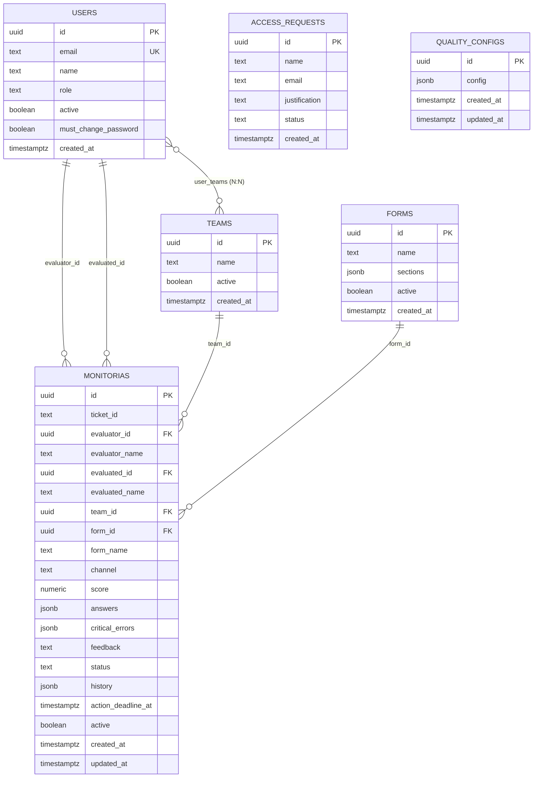

# Schema e Entidades — Banco de Dados

## Visão Geral

O banco de dados é **PostgreSQL** gerenciado pelo **Supabase**. O schema utiliza `public` para tabelas de aplicação e `auth` para autenticação (gerenciado pelo Supabase).

## Diagrama ER

## Tabelas Detalhadas

### `public.users`
| Coluna | Tipo | Default | Descrição |
|---|---|---|---|
| `id` | UUID | PK (= auth.users.id) | ID compartilhado com Supabase Auth |
| `email` | TEXT | UNIQUE | Email do usuário |
| `name` | TEXT | — | Nome completo |
| `role` | TEXT | — | `admin`, `gestor_qualidade`, `gestor_suporte`, `qualidade`, `suporte` |
| `active` | BOOLEAN | `true` | Soft-delete |
| `must_change_password` | BOOLEAN | `false` | Flag para forçar troca de senha |
| `created_at` | TIMESTAMPTZ | `now()` | Data de criação |

> **Nota**: A coluna `team_ids` foi removida (migration M5). O relacionamento N:N entre usuários e equipes é feito via tabela `user_teams`. O frontend enriquece o objeto `User` com `team_ids: string[]` via `enrichUserWithTeamIds()`, mas **nunca** envia `team_ids` em payloads Supabase da tabela `users`.

### `public.user_teams`

| Coluna | Tipo | Default | Descrição |
|---|---|---|---|
| `user_id` | UUID | FK → users | ID do usuário |
| `team_id` | UUID | FK → teams | ID da equipe |

> Tabela N:N — um usuário pode pertencer a múltiplas equipes e uma equipe possui múltiplos usuários. PK composta `(user_id, team_id)`.

### `public.teams`
| Coluna | Tipo | Default | Descrição |
|---|---|---|---|
| `id` | UUID | PK, `gen_random_uuid()` | Identificador único |
| `name` | TEXT | — | Nome da equipe |
| `active` | BOOLEAN | `true` | Soft-delete |
| `created_at` | TIMESTAMPTZ | `now()` | Data de criação |

### `public.forms`
| Coluna | Tipo | Default | Descrição |
|---|---|---|---|
| `id` | UUID | PK | Identificador único |
| `name` | TEXT | — | Nome do formulário |
| `sections` | JSONB | — | Array de pilares com critérios e pesos |
| `active` | BOOLEAN | `true` | Soft-delete |
| `created_at` | TIMESTAMPTZ | `now()` | Data de criação |

### `public.monitorias`
| Coluna | Tipo | Default | Descrição |
|---|---|---|---|
| `id` | UUID | PK | Identificador único |
| `ticket_id` | TEXT | — | ID do ticket avaliado |
| `evaluator_id` | UUID | FK → users | Auditor que criou |
| `evaluator_name` | TEXT | — | Nome do auditor (denormalizado) |
| `evaluated_id` | UUID | FK → users | Agente avaliado |
| `evaluated_name` | TEXT | — | Nome do agente (denormalizado) |
| `team_id` | UUID | FK → teams | Equipe do agente |
| `form_id` | UUID | FK → forms | Formulário usado |
| `form_name` | TEXT | — | Nome do formulário (denormalizado) |
| `channel` | TEXT | — | Canal de atendimento |
| `score` | NUMERIC | — | Score final (0-100) |
| `answers` | JSONB | — | Respostas por critério |
| `critical_errors` | JSONB | `[]` | Erros críticos marcados |
| `feedback` | TEXT | — | Feedback textual |
| `status` | TEXT | — | Status atual (ver MonitoriaStatus) |
| `history` | JSONB | `[]` | Array de HistoryEntry |
| `action_deadline_at` | TIMESTAMPTZ | — | Prazo de ação atual |
| `active` | BOOLEAN | `true` | Soft-delete |
| `created_at` | TIMESTAMPTZ | `now()` | Data de criação |
| `updated_at` | TIMESTAMPTZ | `now()` | Última atualização |

### `public.access_requests`
| Coluna | Tipo | Default | Descrição |
|---|---|---|---|
| `id` | UUID | PK | Identificador único |
| `name` | TEXT | — | Nome do solicitante |
| `email` | TEXT | — | Email do solicitante |
| `justification` | TEXT | — | Motivo do pedido |
| `status` | TEXT | `'pending'` | `pending`, `approved`, `rejected` |
| `created_at` | TIMESTAMPTZ | `now()` | Data da solicitação |

### `public.quality_configs`
| Coluna | Tipo | Default | Descrição |
|---|---|---|---|
| `id` | UUID | PK, `gen_random_uuid()` | Identificador único |
| `config` | JSONB | — | Configuração completa (ver SPEC Quality Config) |
| `created_at` | TIMESTAMPTZ | `now()` | Data de criação |
| `updated_at` | TIMESTAMPTZ | `now()` | Última atualização |

## Campos Denormalizados

As seguintes colunas são **denormalizadas** (duplicam dados de outras tabelas) para performance:
- `monitorias.evaluator_name` — Duplica `users.name`
- `monitorias.evaluated_name` — Duplica `users.name`
- `monitorias.form_name` — Duplica `forms.name`

> Isso evita JOINs nas queries de listagem do dashboard.

## SQL Files no Repositório

| Arquivo | Propósito |
|---|---|
| `auth_migration.sql` | Cria admin padrão no Auth + public.users |
| `create_quality_configs.sql` | Cria tabela quality_configs + RLS |
| `supabase_sla_cron.sql` | Função + cron job para timeout de prazo de ação |
| `supabase/migrations/` | Migrations SQL versionadas (timestamp) — inclui `user_teams`, `dissatisfaction_fields`, `business_hours`, `holidays`, RLS policies |
