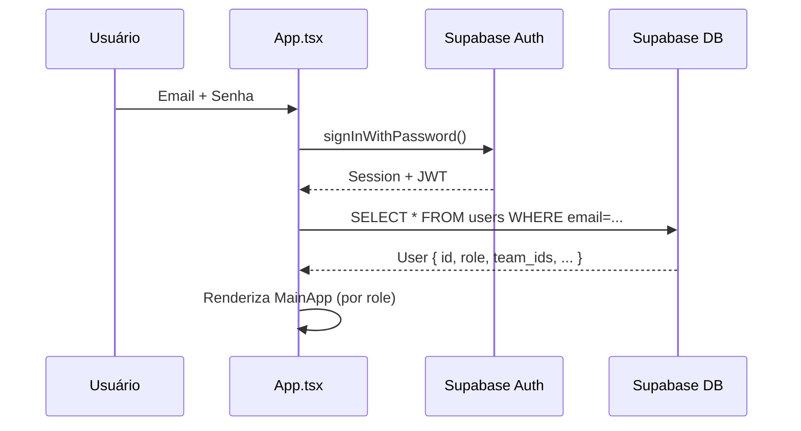
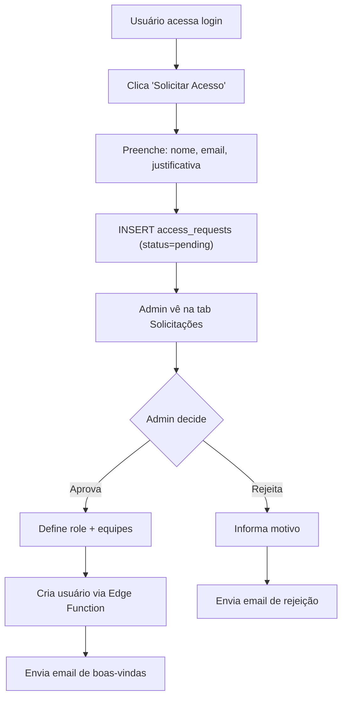

# Fluxo: Autenticação

## Métodos Suportados
- Login com email/senha
- Recuperação de senha (email)
- Convite administrativo (email com link)
- Solicitação de acesso (self-service)

## Fluxo de Login



## Fluxo de Recuperação de Senha

1. Usuário clica "Esqueci minha senha"
2. App chama `auth.resetPasswordForEmail(email, { redirectTo })`
3. Supabase envia email com link de recuperação
4. Link contém hash `#type=recovery&access_token=...`
5. App detecta hash no `useEffect` e mostra formulário de nova senha
6. Usuário define nova senha via `auth.updateUser({ password })`

## Fluxo de Convite (Admin)

1. Admin cria usuário no AdminPanel
2. Frontend chama Edge Function `admin-invite-user`
3. Edge Function:
   - `auth.admin.inviteUserByEmail()` → cria user no Auth
   - INSERT na `public.users` com role e team_ids
4. Supabase envia email de convite com link
5. Link contém hash `#type=invite`
6. App detecta e mostra formulário de definição de senha

## Fluxo de Solicitação de Acesso



## Mock Mode (Desenvolvimento)

Quando Supabase não está configurado:
- Login compara email/senha diretamente no localStorage
- Usuário padrão: `qualidade@webposto.com.br` / `123456` (admin)
- Outros perfis são usuários reais ou temporários e serão removidos na publicação

## Detecção de Hash (Recovery/Invite)

```typescript
// Em App.tsx useEffect
const hash = window.location.hash;
if (hash.includes('type=recovery') || hash.includes('type=invite')) {
  // Mostra formulário de nova senha
  setAuthView('set-password');
}
```
