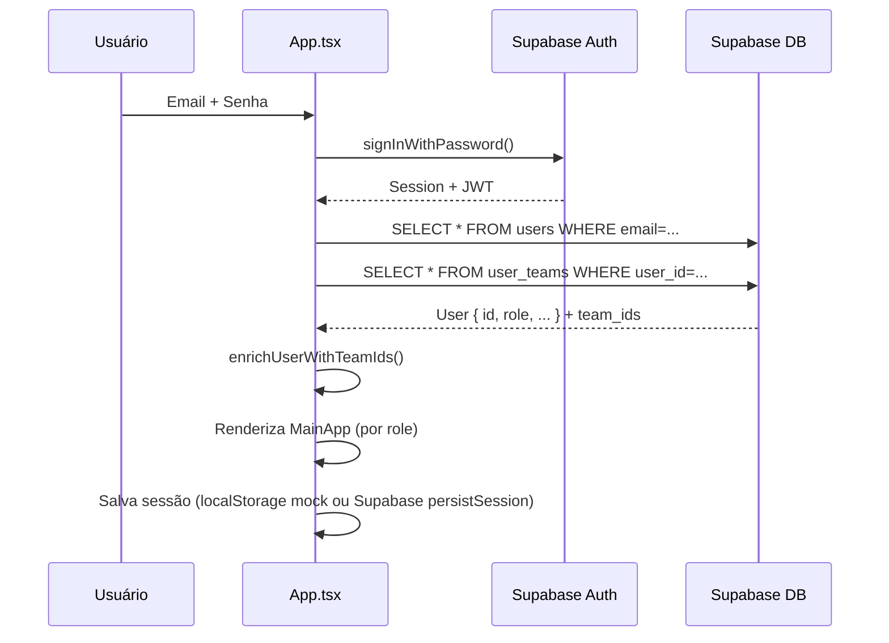
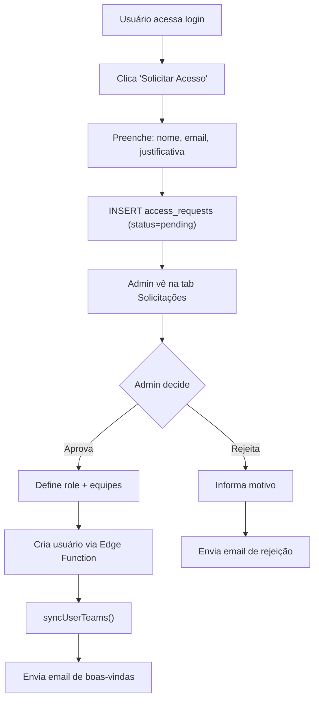

# Fluxo: Autenticação

## Métodos Suportados
- Login com email/senha
- Recuperação de senha (email)
- Convite administrativo (email com link)
- Solicitação de acesso (self-service)

## Fluxo de Login



## Fluxo de Recuperação de Senha

1. Usuário clica "Esqueci minha senha"
2. App chama `auth.resetPasswordForEmail(email, { redirectTo })`
3. Supabase envia email com link de recuperação
4. Link contém hash `#type=recovery&access_token=...`
5. App detecta hash via `isPasswordRecoveryRef` no `useEffect` e mostra formulário de nova senha
6. Usuário define nova senha via `auth.updateUser({ password })`
7. App chama `handleLogout({ silent: true })` + toast contextual

## Fluxo de Convite (Admin)

1. Admin cria usuário no AdminPanel
2. Frontend chama Edge Function `admin-invite-user`
3. Edge Function:
   - `auth.admin.inviteUserByEmail()` → cria user no Auth
   - INSERT na `public.users` (SEM `team_ids`)
   - Sincroniza `user_teams` com os `team_ids` recebidos
4. Supabase envia email de convite com link
5. Link contém hash `#type=invite`
6. App detecta via `isInviteFlowRef` e mostra formulário de definição de senha
7. Após definir senha, `handleLogout({ silent: true })` + toast

## Fluxo de Solicitação de Acesso



## Gerenciamento de Sessão

### Mecanismos
| Mecanismo | Constante | Valor | Descrição |
|-----------|-----------|-------|-----------|
| Idle timeout | `IDLE_TIMEOUT_MS` | 60 min | Sem atividade → logout automático |
| Idle warning | `IDLE_WARNING_MS` | 5 min | Modal com countdown 5 min antes do logout |
| Absolute timeout | `ABSOLUTE_TIMEOUT_MS` | 8 h | Sessão contínua máximo 8h → logout forçado |
| Proactive refresh | `SESSION_REFRESH_MS` | 50 min | `supabase.auth.refreshSession()` a cada 50min |

### Persistência (F5)
- **Supabase**: `INITIAL_SESSION` com session restaura login
- **Mock**: `localStorage` chave `qualitrack_session` (`{userId, sessionStartedAt, sessionExpiresAt}`)
- **Last Activity**: `localStorage` chave `qualitrack_last_activity` — verifica expiração ao restaurar

### Resiliência
- Heartbeat ping ao Supabase a cada 2 min
- Reconexão agressiva (5s polling) quando offline
- `visibilitychange`: verifica expiração ao focar aba
- Event listeners `online`/`offline`
- Evento customizado `qualitrack:reconnected`

### `handleLogout(options?)`
Aceita `{ silent?, message? }` para evitar que `MouseEvent` seja passado como string para Sonner (crash).

## Mock Mode (Desenvolvimento)

Quando Supabase não está configurado:
- Login compara email/senha diretamente no localStorage
- Usuário padrão: `qualidade@webposto.com.br` / `123456` (admin)
- Sessão persistida em `localStorage` (sobrevive a F5 e fechamento de aba)
- Outros perfis são usuários reais ou temporários e serão removidos na publicação

## Detecção de Hash (Recovery/Invite)

```typescript
// Em App.tsx useEffect
const hash = window.location.hash;
if (hash.includes('type=recovery')) {
  isPasswordRecoveryRef.current = true;
}
if (hash.includes('type=invite')) {
  isInviteFlowRef.current = true;
}
```
