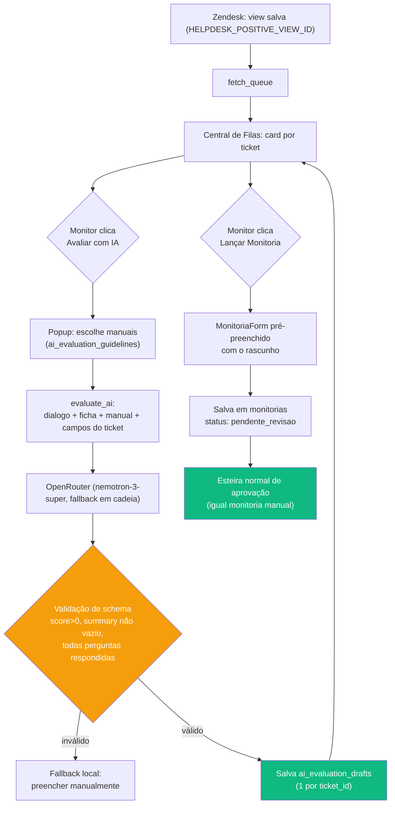

# Fluxo: Central de Filas & Avaliação por IA

## Visão Geral

Triagem automática de chamados do Zendesk em três filas (Negativas, Proativas, Positivas), com avaliação assistida por IA na fila de Positivas. Implementa parcialmente o Épico 1 de [`docs/specs/ai-triage-process-adherence.md`](../specs/ai-triage-process-adherence.md) — ver "Divergência do plano original" abaixo.

Componente principal: `src/components/AuditingQueueView.tsx`. Toda integração externa (Zendesk, OpenRouter) passa pela Edge Function `supabase/functions/helpdesk-queue/index.ts` — nunca direto do frontend.

## Fluxo Completo (fila de Positivas)

Negativas e Proativas não passam pelas etapas D–J: o card já tem um botão direto para abrir o `MonitoriaForm` (Negativas) ou usam a fila de equidade calculada localmente a partir de `agents`/`monitorias`, sem chamar o Zendesk (Proativas).

## Identidade Universal de Agentes

Vínculo agente↔conta feito por **e-mail**, não por lista local. Ver `resolveOrCreateAgent()` em `helpdesk-queue/index.ts`.

1. Busca `public.users` por email.
2. Se não existe: cria conta **provisória** (`is_provisional: true`, `source_system`, `external_id`, `role: 'suporte'`, sem senha/convite).
3. Ao criar a conta formal com o mesmo e-mail, o trigger `handle_new_user()` (migration `20260825000003`) migra `monitorias.evaluator_id/evaluated_id`, `helpdesk_submissions.created_by` e `user_teams` da conta provisória para a definitiva, e apaga a provisória.

`public.users.id` **não tem `DEFAULT`** — criar conta provisória exige gerar o UUID explicitamente (`crypto.randomUUID()`), senão o insert falha com violação de not-null.

## Rascunho de Avaliação (`ai_evaluation_drafts`)

Uma linha por `ticket_id` (UNIQUE), sobrescrita a cada reavaliação. Desacopla "rodar a IA" de "abrir a ficha": `handleEvaluateWithAI` só salva o rascunho; `handleLaunchMonitoria` (em `AuditingQueueView.tsx`) é quem chama `onStartAudit`. Apagado automaticamente quando o ticket correspondente aparece como `already_audited` (monitoria real já existe).

## Ações da Edge Function `helpdesk-queue`

| Action | Papel exigido | Observação |
|---|---|---|
| `fetch_queue` | admin, gestor_qualidade, qualidade, gestor_suporte | Busca tickets (view salva ou Search API + paginação por cursor) |
| `fetch_dialogue` | idem | Comentários do ticket + `ticket_fields` (classificação) |
| `evaluate_ai` | idem | Chama OpenRouter; não depende do Zendesk |
| `lookup_ticket_agent` | idem | Só leitura, usado no `MonitoriaForm` manual |
| `resolve_agent` | idem | Cadastro manual de agente não existente |
| `sync_zendesk_groups` | **admin apenas** | Importa grupos do Zendesk como `public.teams` (não duplica por nome) |

`ticket_id`, quando presente, é validado como `/^\d+$/` **antes** de qualquer dispatch — interpolado cru numa URL do Zendesk, um valor não numérico permitiria path traversal para outro endpoint da API usando o `ZENDESK_API_TOKEN` privilegiado (achado corrigido em revisão de segurança, 25/08).

## Modelo de IA

`OPENROUTER_MODEL` aceita lista separada por vírgula — o parâmetro `models` (não `model`) do OpenRouter tenta em cadeia. Ordem atual prioriza confiabilidade sobre velocidade: só `nvidia/nemotron-3-super-120b-a12b:free` foi confirmado respeitando o `json_schema` com fidelidade nos campos; outros modelos gratuitos testados (`minimax-*`, `dots-studio-*`) ignoravam o schema e devolviam `200 OK` com campos inventados.

**Ordem das propriedades no `responseSchema` importa**: `answers` vem antes de `score`/`summary` — testado que, na ordem inversa, o modelo "reservava" `score: 0` e `summary: ""` antes de avaliar qualquer critério (typeof correto, valor semanticamente vazio). A validação pós-parse rejeita isso explicitamente (`score > 0`, `summary.trim().length > 0`), não só `typeof`.

## Tabelas Novas

Ver [`docs/database/schema.md`](../database/schema.md#ai_evaluation_guidelines) para `ai_evaluation_guidelines`, `ai_evaluation_drafts` e as colunas novas em `users`.

## Configuração (Secrets do Supabase)

| Secret | Obrigatório | Propósito |
|---|---|---|
| `ZENDESK_SUBDOMAIN` / `ZENDESK_EMAIL` / `ZENDESK_API_TOKEN` | Sim | Acesso à API do Zendesk |
| `HELPDESK_NEGATIVE_VIEW_ID` / `HELPDESK_POSITIVE_VIEW_ID` | Não (fallback: Search API) | View salva por fila |
| `HELPDESK_VALIDATED_TAG` | Não | Exclui negativas já validadas por tag/macro |
| `OPENROUTER_API_KEY` | Sim (para `evaluate_ai`) | Chave da IA |
| `OPENROUTER_MODEL` | Não (default hardcoded) | Lista de modelos com fallback |

## Divergência do Plano Original

`docs/specs/ai-triage-process-adherence.md` (31/07) propunha, como pré-requisito (Épico 0), criar uma tabela `tickets` local com sincronização incremental do Zendesk, para viabilizar uma tela de **cobertura** (% de tickets do período sem monitoria).

O que foi implementado consulta o Zendesk **ao vivo** via views salvas, sem tabela local nem job de sincronização — mais rápido de entregar, resolve a mesma dor de amostragem cega para as filas Negativas/Positivas, mas **não produz uma métrica de cobertura formal** (não há como responder "quantos % dos tickets do mês tiveram monitoria" sem consultar o Zendesk sob demanda). O Épico 2 (aderência a processo via Confluence/RAG) não foi iniciado.

## Segurança

Revisão dedicada (25/08, 3 frentes em paralelo) encontrou e corrigiu:

- Falta de checagem de papel em 4 das 6 actions da Edge Function (qualquer autenticado, incl. `suporte`, conseguia ler CSAT/transcrições de qualquer ticket).
- `ticket_id` sem validação de formato (path traversal — ver tabela de actions acima).
- Duas race conditions de UI (agente errado aplicado a um ticket após troca rápida; fila errada sobrescrita ao trocar de aba rápido demais) — corrigidas com refs de "última requisição" descartando respostas obsoletas.
- Hardening de `handle_new_user()`: parou de ler `raw_user_meta_data->>'role'` do Auth (nenhum fluxo legítimo depende disso; mitiga escalonamento de privilégio caso o self-signup público do Supabase esteja habilitado).

Ver [`docs/architecture/backend.md`](../architecture/backend.md) para o modelo de segurança geral (RLS vs. service role).
