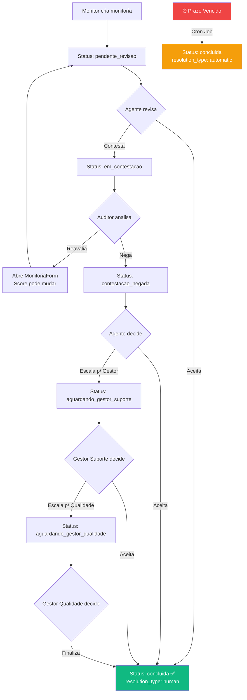

# Fluxo: Monitoria (Auditoria)

## Visão Geral

O fluxo de monitoria é o core do QualiTrack. Cobre desde a criação até a conclusão, passando por contestações multi-nível, com prazos de ação automatizados.

## Fluxo Completo



## Etapas Detalhadas

### 1. Criação (Monitor de Qualidade)

Formulário em 4 etapas (stepper) no `MonitoriaForm.tsx`:

| Etapa | Nome | Conteúdo |
|-------|------|----------|
| 1 | Dados do Ticket | Ticket ID, Canal, Formulário, Agente, Equipe |
| 2 | Avaliação | Critérios por pilar (Sim/Não/N.A.) + Erros Críticos |
| 3 | Resumo | Score calculado, breakdown por pilar, campos de insatisfação |
| 4 | Confirmação | Salvar monitoria |

**Regras de Seleção Agente↔Equipe:**
- Ao selecionar Agente, as opções de Equipe filtram para equipes do agente
- Ao selecionar Equipe, as opções de Agente filtram para agentes da equipe
- **NUNCA limpa automaticamente** o outro campo
- Troca incompatível = bloqueia com toast informativo ("Deselecione o campo X antes de alterar")
- Usuário deve desselecionar (escolher placeholder) para depois alterar o relacionamento

**CustomSelect com Type-ahead:**
- Input inline no dropdown captura teclado
- Filtra opções por digitação (case-insensitive)
- Sem campo "Buscar" visível — o trigger do select serve como campo de busca
- Dropdown via React Portal (resolve z-index/clipping)

**Cálculo automático:**
- Score calculado em tempo real conforme respostas são preenchidas
- Erros críticos: qualquer marcado → Score = 0%
- Prazo de ação calculado via `addBusinessHours()`

### 2. Revisão (Agente)

- Agente vê a monitoria na `MonitoriaList`
- Vê score, feedback, detalhes da avaliação
- **Auditor aparece como "Equipe de Qualidade"** (anônimo) — regra de anonimização
- Pode **Aceitar** → `concluida`, `resolution_type: human`
- Pode **Contestar** (com justificativa) → `em_contestacao`

### 3. Análise de Contestação (Auditor)

- Auditor vê justificativa do agente
- Pode **Reavaliar**: abre `MonitoriaForm` pré-preenchido, pode alterar respostas
  - Score anterior registrado no `history` como `previous_score`
  - Novo score calculado
  - Status volta para `pendente_revisao`
  - Novo prazo de ação calculado
- Pode **Negar**: status vai para `contestacao_negada`

### 4. Pós-Negação (Agente)

- Agente vê que contestação foi negada
- Pode **Aceitar** → `concluida`
- Pode **Escalar para Gestor de Suporte** → `aguardando_gestor_suporte`

### 5. Decisão do Gestor de Suporte

- Pode **Aceitar** a nota → `concluida`
- Pode **Escalar para Gestor de Qualidade** → `aguardando_gestor_qualidade`

### 6. Decisão Final (Gestor de Qualidade)

- **Finaliza** a monitoria → `concluida`
- Pode ajustar score se necessário

### 7. Auto-Finalização (Prazo de Ação)

Cron job `process_action_deadline_timeouts()` executa a cada 5 min:

| Posse Atual | Resultado | resolution_type |
|---|---|---|
| Qualidade (em_contestacao, aguardando_gestor_qualidade) | Score → **100%**, status → `concluida` | `automatic` |
| Suporte (pendente_revisao, aguardando_gestor_suporte, contestacao_negada) | Score mantido, status → `concluida` | `automatic` |

> Indicador visual: ícone `Clock` + label no `RecentAuditsTable` quando `resolution_type === 'automatic'`

## Audit Trail (History)

Cada ação gera uma entrada no array `history`:

```typescript
interface MonitoriaHistoryEntry {
  action: string;      // "Monitoria Criada", "Contestada", "Aceita", etc.
  by_id: string;       // UUID do autor
  by_name: string;     // Nome do autor
  at: string;          // ISO timestamp
  note?: string;       // Justificativa/observação
  previous_score?: number; // Score antes de reavaliação
}
```

## Contestação — Lógica History-based

Widgets escaneiam `history[]` por palavras-chave:
- **Aprovada**: "aceita", "procedente", "alterada"
- **Rejeitada**: "negada", "recusada", "mantida", "Improcedente"

Usa **última resolução** apenas para evitar contagem dupla. Lógica extraída para `src/lib/contestation.ts`:
- `isApprovalAction(action)` — verifica se action é aprovação
- `isRejectionAction(action)` — verifica se action é rejeição

## Tabela de Transições de Status

| De | Ação | Para | Quem |
|---|---|---|---|
| `pendente_revisao` | aceitar | `concluida` | Agente |
| `pendente_revisao` | contestar | `em_contestacao` | Agente |
| `em_contestacao` | reavaliar | `pendente_revisao` | Auditor |
| `em_contestacao` | negar | `contestacao_negada` | Auditor |
| `contestacao_negada` | aceitar | `concluida` | Agente |
| `contestacao_negada` | escalar | `aguardando_gestor_suporte` | Agente |
| `aguardando_gestor_suporte` | aceitar | `concluida` | Gestor Suporte |
| `aguardando_gestor_suporte` | escalar | `aguardando_gestor_qualidade` | Gestor Suporte |
| `aguardando_gestor_qualidade` | finalizar | `concluida` | Gestor Qualidade |
| [Qualquer status ativo] | prazo expirado | `concluida` | Cron (auto) |

## Cálculo de Score

```
score = Σ(pontos_obtidos × peso_pilar) / Σ(pontos_possíveis × peso_pilar) × 100
```

- Critérios N/A excluídos do cálculo (numerador e denominador)
- **Erro crítico**: qualquer marcado → Score = 0%
- Pesos dos pilares são relativos (não precisam somar 100)

## Anonimização

| Role | Vê como |
|---|---|
| `suporte` | Avaliador → "Equipe de Qualidade" |
| `gestor_suporte` | Avaliador → "Equipe de Qualidade" |
| `qualidade` | Nome real do avaliador |
| `gestor_qualidade` | Nome real |
| `admin` | Nome real |

## Campos da Monitoria (Referência)

Ver `src/types.ts` → `Monitoria` interface. Campos notáveis:
- `resolution_type`: `'human' | 'automatic'` — como foi concluída
- `contestation_result`: `'approved' | 'rejected' | 'pending'` — resultado da contestação
- `form_snapshot`: `EvaluationForm` — snapshot do formulário no momento da avaliação
- `applied_config`: `Record<string, unknown>` — config aplicada no cálculo
- `selected_critical_errors`: `string[]` — IDs dos erros críticos marcados
- `dissatisfaction_answers`: `Record<string, string[]>` — respostas dos campos de insatisfação
