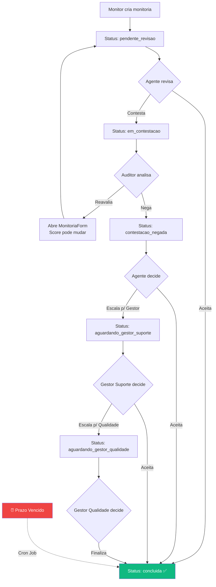

# Fluxo: Monitoria (Auditoria)

## Visão Geral

O fluxo de monitoria é o core do QualiTrack. Cobre desde a criação até a conclusão, passando por contestações multi-nível.

## Fluxo Completo



## Etapas Detalhadas

### 1. Criação (Monitor de Qualidade)
- Seleciona ticket, agente, equipe, canal, formulário
- **Agente↔Equipe**: ao selecionar um campo, o outro filtra suas opções automaticamente; nunca limpa a seleção atual; troca incompatível bloqueada com toast
- **Type-ahead**: nos dropdowns, pode digitar para filtrar opções em tempo real
- Avalia cada critério de cada pilar (Sim/Não/N.A.)
- Marca erros críticos (se houver)
- Escreve feedback
- Sistema calcula score automaticamente
- Sistema calcula prazo de ação com `addBusinessHours()`
- Monitoria salva com status `pendente_revisao`

### 2. Revisão (Agente)
- Agente vê a monitoria na lista
- Vê score, feedback, detalhes da avaliação
- **Auditor aparece como "Equipe de Qualidade"** (anônimo)
- Pode **Aceitar** → `concluida`
- Pode **Contestar** (com justificativa) → `em_contestacao`

### 3. Análise de Contestação (Auditor)
- Auditor vê justificativa do agente
- Pode **Reavaliar**: abre formulário pré-preenchido, pode alterar respostas
  - Score anterior é registrado no histórico
  - Novo score é calculado
  - Status volta para `pendente_revisao`
- Pode **Negar**: status vai para `contestacao_negada`

### 4. Pós-Negação (Agente)
- Agente vê que contestação foi negada
- Pode **Aceitar** → `concluida`
- Pode **Escalar para Gestor de Suporte** → `aguardando_gestor_suporte`

### 5. Decisão do Gestor de Suporte
- Pode **Aceitar** a nota → `concluida`
- Pode **Escalar para Gestor de Qualidade** → `aguardando_gestor_qualidade`

### 6. Decisão Final (Gestor de Qualidade)
- **Finaliza** a monitoria → `concluida`
- Pode ajustar score se necessário

### 7. Auto-Finalização (Prazo de Ação)
- Se qualquer etapa vence o prazo:
  - **Qualidade perdeu prazo** → Score = 100%, `concluida`
  - **Suporte perdeu prazo** → Score mantido, `concluida`

## Audit Trail (History)

Cada ação gera uma entrada no array `history`:

```typescript
interface HistoryEntry {
  action: string;       // "Monitoria Criada", "Contestada", etc.
  by_id: string;        // UUID do autor
  by_name: string;      // Nome do autor
  at: string;           // ISO timestamp
  note?: string;        // Justificativa/observação
  previous_score?: number; // Score antes de reavaliação
}
```
