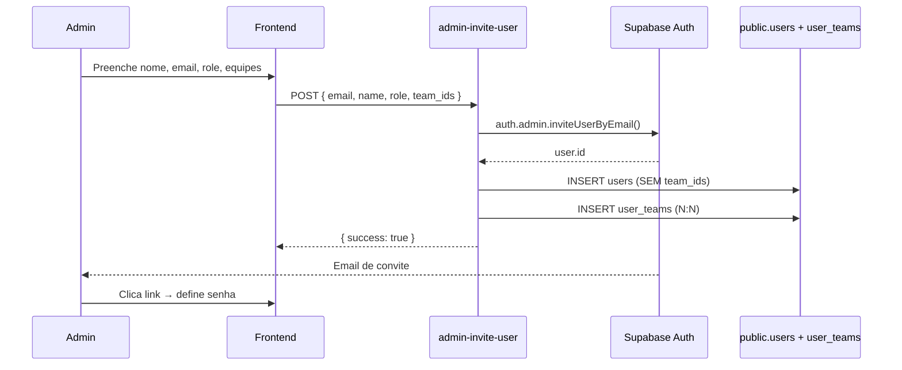
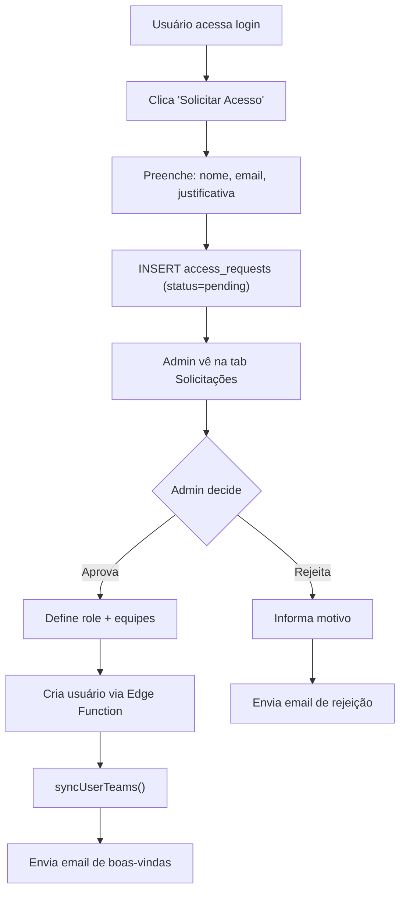

# Fluxo: Onboarding de Usuários

## Métodos de Criação de Usuário

### 1. Convite Administrativo (Recomendado)



**Fluxo no Frontend (`UsersManagement.tsx`):**
1. Admin acessa AdminPanel → tab Usuários
2. Clica "Adicionar Usuário"
3. Preenche: Nome, Email, Perfil (select), Equipes (multi-select com checkboxes; busca condicional se > 8 equipes)
4. Frontend chama Edge Function `admin-invite-user` via `executeWithRetry`
5. Edge Function: cria no Auth + insere na `public.users` + sincroniza `user_teams`
6. Supabase envia email de convite com link
7. Novo usuário clica no link e define sua senha

**Importante**:
- `team_ids` NÃO é enviado no payload da tabela `users`
- Sincronizado via `syncUserTeams()` na Edge Function
- Fallback mock mode: insere diretamente no localStorage

### 2. Solicitação de Acesso (Self-Service)



**Modelo:**
```typescript
interface AccessRequest {
  id: string;
  name: string;
  email: string;
  justification?: string;
  status: 'pending' | 'approved' | 'rejected';
  created_at: string;
}
```

**Permissões para aprovar/rejeitar:** `admin`, `gestor_qualidade`, `gestor_suporte`

### 3. Script SQL (Setup Inicial)
- Migration inicial cria o admin padrão diretamente no banco
- Credenciais padrão: `qualidade@webposto.com.br` / `123456` (admin)
- Usado apenas no setup inicial do sistema
- Outros perfis são usuários reais ou temporários e serão removidos na publicação

## Fluxo de Definição de Senha (Convite/Recovery)

### Detecção de Hash
O `App.tsx` detecta o tipo de fluxo via hash da URL:

```typescript
const hash = window.location.hash;
if (hash.includes('type=recovery')) isPasswordRecoveryRef.current = true;
if (hash.includes('type=invite')) isInviteFlowRef.current = true;
```

### Fluxo de Recovery
1. Link de recuperação contém `#type=recovery&access_token=...`
2. App detecta via `isPasswordRecoveryRef` e mostra formulário de nova senha
3. Usuário define nova senha via `supabase.auth.updateUser({ password })`
4. App chama `handleLogout({ silent: true })` + toast contextual

### Fluxo de Convite
1. Link de convite contém `#type=invite`
2. App detecta via `isInviteFlowRef` e mostra formulário de definição de senha
3. Após definir senha, `handleLogout({ silent: true })` + toast

## Referências
- **Edge Function**: `supabase/functions/admin-invite-user/`
- **Componentes**: `UsersManagement.tsx`, `RequestsManagement.tsx`
- **Auth docs**: `docs/flows/authentication.md`
- **RBAC**: `AGENTS.md` seção 7
