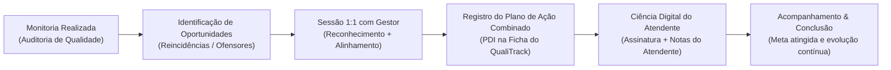

# SPEC: Módulo de Feedbacks 1:1 & Plano de Ação Combinado (PDI)

## Visão Geral & Motivação

O **Módulo de Feedbacks 1:1 & PDI** é o fechamento do ciclo contínuo de Melhoria de Qualidade (QA) no QualiTrack.

Historicamente em operações de atendimento e helpdesk, um problema crônico é o **"feedback que morre no papel"**:
- O monitor audita o ticket e aponta um erro (ex.: falta de evidências antes de transferir o chamado).
- O gestor conversa informalmente com o atendente ("não esqueça de testar antes de escalar").
- O atendente diz que entendeu, mas na semana seguinte o mesmo desvio se repete, gerando retrabalho no N2 e insatisfação no cliente.

Com o módulo de Feedbacks 1:1 e o **Plano de Ação Combinado (PDI)**, a avaliação de qualidade se transforma em um compromisso formal, transparente, com prazo definido e ciência digital do colaborador.



---

## O Conceito: O que é o Plano de Ação Combinado (PDI)?

O **Plano de Ação Combinado** é o compromisso prático de curto prazo alinhado e pactuado entre o gestor e o atendente durante a reunião de 1:1. Ele responde a três perguntas fundamentais:
1. **O que fazer?** Qual ação concreta deve ser adotada nos próximos atendimentos.
2. **Como fazer?** Qual procedimento, ferramenta, checklist ou leitura deve ser seguida.
3. **Até quando?** Qual é a data de revisão e validação dos resultados.

### A Regra de Ouro da Gestão de Qualidade
> **Não aponte apenas a falha — combine uma ação executável e com prazo!**
> 
> *Abordagem Passiva (Ineficaz):* "Você esqueceu de rodar os testes de rede."
> 
> *Plano de Ação Combinado (Eficaz):* "Nos próximos 15 dias, em todos os tickets de lentidão, o atendente seguirá o checklist padrão anexando prints de ping e tracert antes de escalar para o N2."

---

## Exemplos Práticos de Helpdesk & Suporte

A ficha de cadastro (`CreateFeedbackModal.tsx`) disponibiliza modelos interativos prontos que podem ser inseridos com apenas um clique:

### 1. Procedimento Técnico & Triagem de Redes
- **Cenário:** Chamados de suporte transferidos precipitadamente para a equipe de Nível 2 sem testes mínimos de diagnóstico ou evidências coletadas.
- **Oportunidade de Melhoria:** Atendente escalou o ticket #8942 de lentidão sem evidências de ping ou testes de rota.
- **Plano de Ação Combinado:**
  > *"Em todos os chamados de lentidão ou indisponibilidade dos próximos 15 dias, seguir o checklist padrão anexando prints dos testes de ping e traceroute antes de transferir para o N2."*

### 2. Comunicação, Cordialidade & Satisfação (CSAT)
- **Cenário:** Queda no CSAT e reclamações de clientes devido a linguagem excessivamente técnica, fria ou encerramento abrupto do atendimento.
- **Oportunidade de Melhoria:** Nota CSAT insatisfatória por postura impaciente e encerramento sem validar se a dúvida foi sanada.
- **Plano de Ação Combinado:**
  > *"Revisar o Guia de Atendimento Humanizado até sexta-feira e aplicar saudações empáticas e confirmação ativa de resolução antes de encerrar chamados no chat."*

### 3. Regras de Negócio & Base de Conhecimento (KB)
- **Cenário:** Aplicação errônea de políticas de troca, estorno financeiro ou regras operacionais por falta de leitura dos artigos atualizados.
- **Oportunidade de Melhoria:** Solicitação de estorno executada fora do prazo regulamentar por desconhecimento da nova política.
- **Plano de Ação Combinado:**
  > *"Revisar o artigo #402 da Base de Conhecimento sobre a nova política de estornos/reembolsos e alinhar dúvidas pendentes com o monitor de qualidade até o final desta semana."*

---

## Modelo de Dados (`AgentFeedback`)

### Tipagem TypeScript (`src/types.ts`)

```typescript
export type FeedbackStatus = 'pendente_ciencia' | 'ciente' | 'concluido';

export interface AgentFeedback {
  id: string;
  agent_id: string;
  manager_id: string;
  team_id?: string | null;
  monitoria_id?: string | null;
  title: string;
  strengths?: string | null;
  improvements: string;
  action_plan: string;
  status: FeedbackStatus;
  deadline_date?: string | null;
  agent_acknowledged_at?: string | null;
  agent_notes?: string | null;
  completed_at?: string | null;
  created_at: string;
  updated_at: string;
}
```

### Schema SQL (`supabase/migrations/20260926000001_create_agent_feedbacks.sql`)

```sql
CREATE TABLE IF NOT EXISTS public.agent_feedbacks (
    id UUID PRIMARY KEY DEFAULT gen_random_uuid(),
    agent_id UUID NOT NULL REFERENCES public.users(id) ON DELETE CASCADE,
    manager_id UUID NOT NULL REFERENCES public.users(id) ON DELETE CASCADE,
    team_id UUID REFERENCES public.teams(id) ON DELETE SET NULL,
    monitoria_id UUID REFERENCES public.monitorias(id) ON DELETE SET NULL,
    title TEXT NOT NULL,
    strengths TEXT,
    improvements TEXT NOT NULL,
    action_plan TEXT NOT NULL,
    status TEXT NOT NULL DEFAULT 'pendente_ciencia' 
        CHECK (status IN ('pendente_ciencia', 'ciente', 'concluido')),
    deadline_date DATE,
    agent_acknowledged_at TIMESTAMPTZ,
    agent_notes TEXT,
    completed_at TIMESTAMPTZ,
    created_at TIMESTAMPTZ NOT NULL DEFAULT timezone('utc'::text, now()),
    updated_at TIMESTAMPTZ NOT NULL DEFAULT timezone('utc'::text, now())
);
```

---

## Ciclo de Vida & Estados

| Estado | Significado | Quem atua | Ação seguinte |
|---|---|---|---|
| `pendente_ciencia` | Feedback registrado pelo gestor; aguarda leitura e confirmação do atendente | Atendente | Atendente confere a ficha e assina digitalmente com `onAcknowledge` |
| `ciente` | Atendente confirmou ciência do plano (com observações opcionais) | Ambos | Execução das ações práticas no dia a dia até a data estipulada |
| `concluido` | Gestor validou o cumprimento do plano de desenvolvimento | Gestor / Admin | Finalização e arquivamento com status de sucesso |

---

## Matriz de Permissões & RLS (Row Level Security)

| Perfil | Criar Feedback | Visualizar | Confirmar Ciência | Concluir Plano |
|---|---|---|---|---|
| `suporte` (Atendente) | ❌ Não | Apenas os próprios (`agent_id = auth.uid()`) | ✅ Sim (registra timestamp e notas) | ❌ Não |
| `gestor_suporte` | ✅ Sim | Feedbacks de atendentes de suas equipes | ❌ Não (apenas o atendente assina) | ✅ Sim |
| `gestor_qualidade` | ✅ Sim | Todos os feedbacks da operação | ❌ Não | ✅ Sim |
| `admin` | ✅ Sim | Todos os feedbacks da operação | ❌ Não | ✅ Sim |

---

## Componentes Envolvidos

1. **`src/components/feedback/CreateFeedbackModal.tsx`**:
   - Modal com formulário de cadastro estruturado (Reconhecimento, Oportunidades, Plano de Ação, Data de Revisão).
   - Contém o botão retrátil **"O que é o Plano de Ação?"** com a explicação didática e 3 modelos prontos para Helpdesk com o botão **"Usar modelo"**.
2. **`src/components/feedback/FeedbackDetailsModal.tsx`**:
   - Visualização completa da ata de 1:1, link direto para a monitoria associada (se houver), e campo de assinatura digital para o atendente.
3. **`src/components/feedback/FeedbacksWidget.tsx`**:
   - Widget integrado nas visões de Gestor de Suporte, Atendente e Admin, com filtros rápidos por status e alertas de planos pendentes.
4. **`src/hooks/useFeedbacks.ts`**:
   - Hook de gestão com persistência dual (Supabase em produção e `MockDb` em desenvolvimento local).
