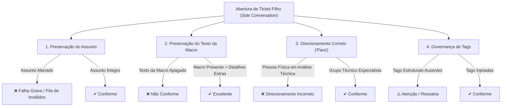

# Manual de Avaliação de Tickets Filhos (QA / QualiTrack)
## Guia Operacional de Conformidade, Auditoria e Validação de Macros do Zendesk

> **Versão:** 1.2 — Atualização Setembro / 2026  
> **Referência Técnica:** Guia Operacional: Catálogo e Utilização de Macros do Zendesk (POP v1.1)  
> **Plataforma:** Zendesk Support & Side Conversations (Conversas Paralelas)  
> **Público-Alvo:** Monitores de Qualidade (QA), Supervisores de Suporte e Analistas de Atendimento  

---

## 1. Objetivo e Diretrizes Gerais de Auditoria

Este manual estabelece os **critérios operacionais objetivos** para a auditoria de qualidade na criação e encaminhamento de **Tickets Filhos (Conversas Paralelas / Side Conversations)** no Zendesk Support.

A integridade dos tickets filhos é fundamental para o fluxo de atendimento da WebPosto, pois o ecossistema do Zendesk utiliza **5 gatilhos estruturais de automação (DB-361)** que dependem estritamente da padronização de **assunto, conteúdo e direcionamento**. Qualquer desvio operacional quebra as regras de roteamento do sistema, gerando atraso no atendimento e envio incorreto do ticket para a fila de **"Chamados Filhos Inválidos" (View Zendesk #47656856998292)**.

---

## 2. Os Três Pilares Mandatórios de Avaliação

Durante a auditoria de um chamado filho, o Monitor de Qualidade e o motor de Inteligência Artificial do QualiTrack avaliam obrigatoriamente **três quesitos essenciais**:

---

### Quesito 1: Preservação Intacta do Assunto (Inalterabilidade)

* **Regra de Ouro:** **O ASSUNTO DO TICKET FILHO NUNCA PODE SER ALTERADO PELO ANALISTA.**
* **Fundamento Técnico:** O Zendesk possui 5 gatilhos estruturais padronizados pelo projeto de dados (DB-361). Esses gatilhos realizam a leitura exata da string de texto do assunto preenchido automaticamente pela macro. Se o analista alterar uma única letra, adicionar o número do chamado pai no título, ou personalizar o texto, a automação falhará e o chamado cairá na fila de *Chamados Filhos Inválidos*.
* **Critério de Avaliação do QA:**
  * **Conforme (Aprovado):** O assunto do ticket filho coincide perfeitamente com o catálogo oficial de macros estruturais.
  * **Não Conforme (Reprovado - Falha Crítica):** O assunto foi renomeado, abreviado, prefixado com dados do cliente ou totalmente reescrito.

#### Catálogo Oficial de Assuntos Homologados:
| Macro Aplicada | Assunto Obrigatório e Inalterável | Fila / Destino Estrutural |
| :--- | :--- | :--- |
| **🛠 Enviar para Análise Técnica CLIENTE FINAL** | `Encaminhado para Análise Técnica Cliente Final` | Análise Técnica - Cliente Final |
| **🛠 Enviar para Análise Técnica REVENDA** | `Encaminhado para Análise Técnica REVENDA` | Análise Técnica - Revenda |
| **📚 Enviar para Análise Técnica Fiscal** | `Encaminhado para Análise Técnica Fiscal` | Análise Técnica Fiscal |
| **🧮 Enviar para Análise Técnica Contábil** | `Encaminhado para Análise Técnica Contábil` | Análise Técnica Contábil |
| **🧩 Enviar para Análise de Correções Cliente Final** | `Encaminhado para Análise Técnica - Correções` *(ou título oficial da macro de correções)* | Análise Técnica - Correções |
| **👨‍💻 Enviar para Desenvolvimento** | `Encaminhado para Desenvolvimento` *(ou padrão P&D)* | P&D / Engenharia |
| **🆕 Registrar Nova Demanda** | `Nova Demanda` *(ou padrão da macro de demanda)* | Próprio Analista |
| **🆕 Registrar Nova Demanda (Mais Pagamentos)** | `Nova Demanda - Mais Pagamentos` *(ou padrão da macro)* | Próprio Analista |
| **👐 Apoio Análise Técnica** | `Apoio Análise Técnica` | Analista N2 Específico |

---

### Quesito 2: Preservação do Texto da Macro com Enriquecimento Técnico

* **Regra de Negócio:** **O TEXTO DO COMENTÁRIO PRECISA CONTER A MENSAGEM INTEGRAL DA MACRO.**
* **Diretriz de Conteúdo:**
  1. **A macro é a base obrigatória:** O analista não pode apagar o texto modelo pré-formatado inserido pela macro (saudação técnica, cabeçalho de triagem, campos padronizados).
  2. **Acréscimo de informações é permitido e incentivado:** O analista **PODE E DEVE** inserir mais informações técnicas complementares além do texto da macro, tais como:
     - Dados do posto / cliente / CNPJ / contato;
     - Versão dos sistemas (WebPosto, PDV, Concentrador, TEF);
     - ID de Acesso Remoto (AnyDesk / TeamViewer) e senha provisória;
     - Descrição detalhada da falha, cenário de ocorrência e testes já executados no N1;
     - Logs de erro colhidos, prints ou mensagens de rejeição fiscal (XML / SEFAZ).
* **Critério de Avaliação do QA:**
  * **Conforme / Excelente:** O texto-base da macro está integralmente presente e foi complementado com evidências técnicas sólidas.
  * **Conforme / Regular:** O texto-base da macro está presente, mas com dados complementares mínimos.
  * **Não Conforme (Reprovado):** O analista apagou o texto da macro e deixou uma observação genérica (ex: *"ver com o cliente"*, *"favor analisar"*), ou o comentário está em branco.

---

### Quesito 3: Direcionamento Correto do Campo "Para" (Side Conversation Assignee / Grupo)

* **Regra de Roteamento:** Ao acionar qualquer macro que crie uma Conversa Paralela (Ticket Filho), o painel lateral do Zendesk abre o campo **"Para"**. O analista **DEVE** selecionar o destinatário estritamente conforme a matriz de governança:

| Tipo de Demanda / Macro | O que selecionar no campo "Para"? | Motivo Operacional | Erro Crítico a Evitar |
| :--- | :--- | :--- | :--- |
| **🛠 Enviar para Análise Técnica** *(Cliente Final, Revenda, Fiscal, Contábil, Correções, Dev)* | **O GRUPO correspondente da Análise Técnica** *(ex: Análise Técnica Fiscal, Análise Técnica Revenda, etc.)* | O chamado deve entrar na fila coletiva do time especialista N2 para distribuição por SLA. | **NUNCA atribuir a um analista individual (pessoa física).** |
| **🆕 Registrar Nova Demanda** *(Geral ou Mais Pagamentos)* | **O PRÓPRIO ANALISTA (Você mesmo / Auto-atribuição)** | O atendente que identificou a demanda fica responsável pelo acompanhamento do ciclo de vida até a entrega. | Atribuir para terceiros ou deixar sem atribuição. |
| **👐 Apoio Análise Técnica** | **O Analista Técnico N2 específico que prestou o auxílio** | Atribuição nominal direta ao especialista que fez a consultoria pontual durante o atendimento. | Direcionar para grupo coletivo quando o atendimento foi individual. |
| **⚡ Operação Mais Pagamentos** | **Grupo Mais Pagamentos (ID 50800061906068)** / Marca dedicada | Encaminhamento para a operação dedicada de TEF e maquininhas. | Direcionar para fila de suporte padrão PDV. |

* **Critério de Avaliação do QA:**
  * **Conforme:** O campo "Para" aponta com precisão para o grupo ou analista definido na regra.
  * **Não Conforme (Reprovado):**
    - Chamado de Análise Técnica atribuído a um atendente específico em vez do grupo coletivo.
    - Nova Demanda atribuída incorretamente para grupos de atendimento direto.

---

## 3. Governança de Tags e Preservação Histórica

Além dos três pilares, o monitor de qualidade deve certificar-se da integridade das tags injetadas:

1. **Tags Obrigatórias por Macro:**
   - **Nova Demanda:** Presença mandatória das tags `existe_ticket_filho` e `existe_nova_demanda`.
   - **Nova Demanda Mais Pagamentos:** Tags `existe_ticket_filho` e `maispag_nova_demanda`.
   - **Análise Técnica:** Tags correspondentes ao escopo: `transferencia_analise`, `transferencia_analise_fiscal`, `transferencia_analise_contabil`, etc.
2. **Blindagem contra Perda de Tags (`current_tags`):**
   - O analista nunca deve remover manualmente tags de governança ou aplicar macros depreciadas que façam substituição total (`set_tags`). O QualiTrack audita a presença das tags transitórias e definitivas.

---

## 4. Matriz de Pontuação e Status do Parecer (QualiTrack)

O sistema de auditoria inteligente calcula a pontuação de conformidade com base nos seguintes pesos:

| Quesito Auditado | Peso no Score | Penalidade se Não Conforme | Impacto no Status Geral |
| :--- | :---: | :---: | :--- |
| **1. Preservação do Assunto** | **35%** | -35 pts | Se reprovado, limita o status máximo a **Não Conforme** (quebra de automação). |
| **2. Preservação do Texto da Macro** | **30%** | -30 pts | Se ausente, penaliza gravemente a nota da monitoria. |
| **3. Direcionamento Correto ("Para")** | **25%** | -25 pts | Direcionamento incorreto rebaixa para **Atenção** ou **Não Conforme**. |
| **4. Governança de Tags Estruturais** | **10%** | -10 pts | Tags ausentes geram alerta operacional. |

### Classificação de Parecer:
* 🟢 **Conforme (90 a 100 pontos):** Todos os três pilares cumpridos com rigor; assunto inalterado; macro presente e detalhada com logs/AnyDesk; direcionamento exato.
* 🟡 **Atenção / Ressalvas (70 a 89 pontos):** Assunto e direcionamento corretos, mas com detalhamento técnico insuficiente no comentário adicional ou pequena divergência de tags.
* 🔴 **Não Conforme (0 a 69 pontos):** Assunto alterado (gatilho quebrado), texto da macro suprimido ou encaminhamento para destino incorreto.

---

## 5. Checklist Rápido de Pré-Validação para o Auditor

Ao auditar um chamado na fila de **Triagem de Chamados Filhos**, execute o seguinte checklist:

- [ ] **1. Assunto:** O título do chamado filho coincide estritamente com o catálogo? (Sem IDs extras, sem nomes de postos inseridos no assunto).
- [ ] **2. Texto:** A mensagem estrutural da macro foi mantida? Há enriquecimento com dados técnicos (AnyDesk, logs, passos de teste)?
- [ ] **3. Destinatário ("Para"):** O ticket foi para o Grupo Técnico correto (ou para o próprio analista no caso de Nova Demanda)?
- [ ] **4. Tags:** As tags estruturais (`existe_ticket_filho`, `transferencia_analise`, etc.) constam no ticket?
- [ ] **5. Chamado Pai Vinculado:** O ID do chamado pai (`parent_ticket_id` / `problem_id`) foi capturado e validado corretamente?

---

*WebPosto • Central de Atendimento & Governança de Dados*  
*Documentação de Qualidade — QualiTrack QA Engine*
