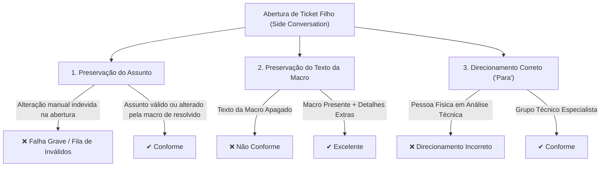

# Manual de Avaliação de Tickets Filhos (QA / QualiTrack)
## Guia Operacional de Conformidade, Auditoria e Validação de Macros do Zendesk

> **Versão:** 1.2 — Atualização Setembro / 2026  
> **Referência Técnica:** Guia Operacional: Catálogo e Utilização de Macros do Zendesk (POP v1.1)  
> **Plataforma:** Zendesk Support & Side Conversations (Conversas Paralelas)  
> **Público-Alvo:** Monitores de Qualidade (QA), Supervisores de Suporte e Analistas de Atendimento  

---

## 1. Objetivo e Diretrizes Gerais de Auditoria

Este manual estabelece os **critérios operacionais objetivos** para a auditoria de qualidade na criação e encaminhamento de **Tickets Filhos (Conversas Paralelas / Side Conversations)** no Zendesk Support.

A integridade dos tickets filhos é fundamental para o fluxo de atendimento da WebPosto, pois o ecossistema do Zendesk utiliza **5 gatilhos estruturais de automação (DB-361)** que dependem estritamente da padronização de **assunto, conteúdo e direcionamento**. Qualquer desvio operacional quebra as regras de roteamento do sistema, gerando atraso no atendimento e envio incorreto do ticket para a fila de **"Chamados Filhos Inválidos" (View Zendesk #47656856998292)**.

---

## 2. Os Três Pilares Mandatórios de Avaliação

Durante a auditoria de um chamado filho, o Monitor de Qualidade e o motor de Inteligência Artificial do QualiTrack avaliam obrigatoriamente **três quesitos essenciais**:

```mermaid
flowchart TD
    TF["Abertura de Ticket Filho (Side Conversation)"] --> Q1["1. Preservação do Assunto"]
    TF --> Q2["2. Preservação do Texto da Macro"]
    TF --> Q3["3. Direcionamento Correto ('Para')"]
    
    Q1 -->|Alteração manual indevida na abertura| INV["❌ Falha Grave / Fila de Inválidos"]
    Q1 -->|Assunto válido ou alterado pela macro de resolvido| OK1["✔ Conforme"]
    
    Q2 -->|Texto da Macro Apagado| REP["❌ Não Conforme"]
    Q2 -->|Macro Presente + Detalhes Extras| OK2["✔ Excelente"]
    
    Q3 -->|Pessoa Física em Análise Técnica| ERRO["❌ Direcionamento Incorreto"]
    Q3 -->|Grupo Técnico Especialista| OK3["✔ Conforme"]
    
```

---

### Quesito 1: Assunto da Abertura e Macro de Resolvido

* **Regra de Ouro:** O analista não deve descaracterizar manualmente o assunto criado pela macro de abertura. O prefixo `Ticket` e o identificador do chamado pai são aceitos.
* **Fundamento Técnico:** Os gatilhos estruturais do Zendesk dependem do assunto da abertura. A macro de resolvido altera o assunto automaticamente depois; o título atual pode, portanto, diferir do título original sem indicar falha na abertura.
* **Critério de Avaliação do QA:**
  * **Conforme (Aprovado):** O assunto da abertura corresponde à macro estrutural, incluindo prefixo ou ID do pai. Também é conforme quando o assunto atual foi alterado pela macro de resolvido.
  * **Não Conforme (Reprovado - Falha Crítica):** Há evidência de que o analista descaracterizou manualmente o assunto antes da resolução.

#### Catálogo Oficial de Assuntos Homologados:
| Macro Aplicada | Assunto de Abertura Homologado | Fila / Destino Estrutural |
| :--- | :--- | :--- |
| **🛠 Enviar para Análise Técnica CLIENTE FINAL** | `Encaminhado para Análise Técnica Cliente Final` | Análise Técnica - Cliente Final |
| **🛠 Enviar para Análise Técnica REVENDA** | `Encaminhado para Análise Técnica REVENDA` | Análise Técnica - Revenda |
| **📚 Enviar para Análise Técnica Fiscal** | `Encaminhado para Análise Técnica Fiscal` | Análise Técnica Fiscal |
| **🧮 Enviar para Análise Técnica Contábil** | `Encaminhado para Análise Técnica Contábil` | Análise Técnica Contábil |
| **🧩 Enviar para Análise de Correções Cliente Final** | `Encaminhado para Análise Técnica - Correções` *(ou título oficial da macro de correções)* | Análise Técnica - Correções |
| **👨‍💻 Enviar para Desenvolvimento** | `Encaminhado para Desenvolvimento` *(ou padrão P&D)* | P&D / Engenharia |
| **🆕 Registrar Nova Demanda** | `Nova Demanda` *(ou padrão da macro de demanda)* | Próprio Analista |
| **🆕 Registrar Nova Demanda (Mais Pagamentos)** | `Nova Demanda - Mais Pagamentos` *(ou padrão da macro)* | Próprio Analista |
| **👐 Apoio Análise Técnica** | `Apoio Análise Técnica` | Analista N2 Específico |

---

### Quesito 2: Preservação do Texto da Macro com Enriquecimento Técnico

* **Regra de Negócio:** **O TEXTO DO COMENTÁRIO PRECISA CONTER A MENSAGEM INTEGRAL DA MACRO.**
* **Diretriz de Conteúdo:**
  1. **A macro é a base obrigatória:** O analista não pode apagar o texto modelo pré-formatado inserido pela macro (saudação técnica, cabeçalho de triagem, campos padronizados).
  2. **Acréscimo de informações é permitido e incentivado:** O analista **PODE E DEVE** inserir mais informações técnicas complementares além do texto da macro, tais como:
     - Dados do posto / cliente / CNPJ / contato;
     - Versão dos sistemas (WebPosto, PDV, Concentrador, TEF);
     - ID de Acesso Remoto (AnyDesk / TeamViewer) e senha provisória;
     - Descrição detalhada da falha, cenário de ocorrência e testes já executados no N1;
     - Logs de erro colhidos, prints ou mensagens de rejeição fiscal (XML / SEFAZ).
* **Critério de Avaliação do QA:**
  * **Conforme / Excelente:** O texto-base da macro está integralmente presente e foi complementado com evidências técnicas sólidas.
  * **Conforme / Regular:** O texto-base da macro está presente, mas com dados complementares mínimos.
  * **Não Conforme (Reprovado):** O analista apagou o texto da macro e deixou uma observação genérica (ex: *"ver com o cliente"*, *"favor analisar"*), ou o comentário está em branco.

---

### Quesito 3: Direcionamento Correto do Campo "Para" (Side Conversation Assignee / Grupo)

* **Regra de Roteamento:** Ao acionar qualquer macro que crie uma Conversa Paralela (Ticket Filho), o painel lateral do Zendesk abre o campo **"Para"**. O analista **DEVE** selecionar o destinatário estritamente conforme a matriz de governança:

| Tipo de Demanda / Macro | O que selecionar no campo "Para"? | Motivo Operacional | Erro Crítico a Evitar |
| :--- | :--- | :--- | :--- |
| **🛠 Enviar para Análise Técnica** *(Cliente Final, Revenda, Fiscal, Contábil, Correções, Dev)* | **O GRUPO correspondente da Análise Técnica** *(ex: Análise Técnica Fiscal, Análise Técnica Revenda, etc.)* | O chamado deve entrar na fila coletiva do time especialista N2 para distribuição por SLA. | **NUNCA atribuir a um analista individual (pessoa física).** |
| **🆕 Registrar Nova Demanda** *(Geral ou Mais Pagamentos)* | **O PRÓPRIO ANALISTA (Você mesmo / Auto-atribuição)** | O atendente que identificou a demanda fica responsável pelo acompanhamento do ciclo de vida até a entrega. | Atribuir para terceiros ou deixar sem atribuição. |
| **👐 Apoio Análise Técnica** | **O Analista Técnico N2 específico que prestou o auxílio** | Atribuição nominal direta ao especialista que fez a consultoria pontual durante o atendimento. | Direcionar para grupo coletivo quando o atendimento foi individual. |
| **⚡ Operação Mais Pagamentos** | **Grupo Mais Pagamentos (ID 50800061906068)** / Marca dedicada | Encaminhamento para a operação dedicada de TEF e maquininhas. | Direcionar para fila de suporte padrão PDV. |

* **Critério de Avaliação do QA:**
  * **Conforme:** O campo "Para" aponta com precisão para o grupo ou analista definido na regra.
  * **Não Conforme (Reprovado):**
    - Chamado de Análise Técnica atribuído a um atendente específico em vez do grupo coletivo.
    - Nova Demanda atribuída incorretamente para grupos de atendimento direto.

---

## 3. Matriz de Pontuação e Status do Parecer (QualiTrack)

### Ficha padrão no QualiTrack

A ficha **Ficha de Monitoria de Ticket Filho** é selecionada automaticamente na fila de Chamados Filhos e na abertura manual quando o ticket já foi identificado como filho. Ela usa os três pilares deste manual, com pesos de 35% para assunto, 40% para texto da macro e 25% para direcionamento. A seção de assunto também confere o vínculo com o ticket pai; a seção de texto distingue preservação do modelo e qualidade do complemento técnico.

Falhas na preservação do assunto ou do texto-base são críticas. A avaliação da IA é apenas apoio: o auditor preenche e confirma cada resposta da ficha antes de salvar. Em monitorias antigas, a ficha originalmente usada permanece no histórico; quando a origem do ticket filho está registrada no job ou log de IA, a reavaliação abre a ficha própria com respostas novas, sem copiar respostas de critérios de atendimento.

O sistema de auditoria inteligente considera apenas os três quesitos abaixo. Tags do Zendesk não compõem o parecer nem a nota.

| Quesito Auditado | Impacto no Status Geral |
| :--- | :--- |
| **1. Preservação do Assunto** | Se reprovado, limita o status máximo a **Não Conforme**. |
| **2. Preservação do Texto da Macro** | Se ausente, penaliza gravemente a nota da monitoria. |
| **3. Direcionamento Correto ("Para")** | Direcionamento incorreto rebaixa para **Atenção** ou **Não Conforme**. |

### Classificação de Parecer:
* 🟢 **Conforme (90 a 100 pontos):** Todos os três pilares cumpridos com rigor; assunto da abertura válido, inclusive após mudança pela macro de resolvido; macro presente e detalhada com logs/AnyDesk; direcionamento exato.
* 🟡 **Atenção / Ressalvas (70 a 89 pontos):** Assunto e direcionamento corretos, mas com detalhamento técnico insuficiente no comentário adicional.
* 🔴 **Não Conforme (0 a 69 pontos):** Assunto da abertura alterado manualmente de forma indevida, texto da macro suprimido ou encaminhamento para destino incorreto.

---

## 4. Checklist Rápido de Pré-Validação para o Auditor

Ao auditar um chamado na fila de **Triagem de Chamados Filhos**, execute o seguinte checklist:

- [ ] **1. Assunto:** O título da abertura corresponde à macro, considerando prefixo e ID do pai? Se o ticket foi resolvido, a mudança automática de assunto pela macro de resolvido foi aceita?
- [ ] **2. Texto:** A mensagem estrutural da macro foi mantida? Há enriquecimento com dados técnicos (AnyDesk, logs, passos de teste)?
- [ ] **3. Destinatário ("Para"):** O ticket foi para o Grupo Técnico correto (ou para o próprio analista no caso de Nova Demanda)?
- [ ] **4. Chamado Pai Vinculado:** O ID do chamado pai (`parent_ticket_id` / `problem_id`) foi capturado e validado corretamente?

---

*WebPosto • Central de Atendimento & Governança de Dados*  
*Documentação de Qualidade — QualiTrack QA Engine*
