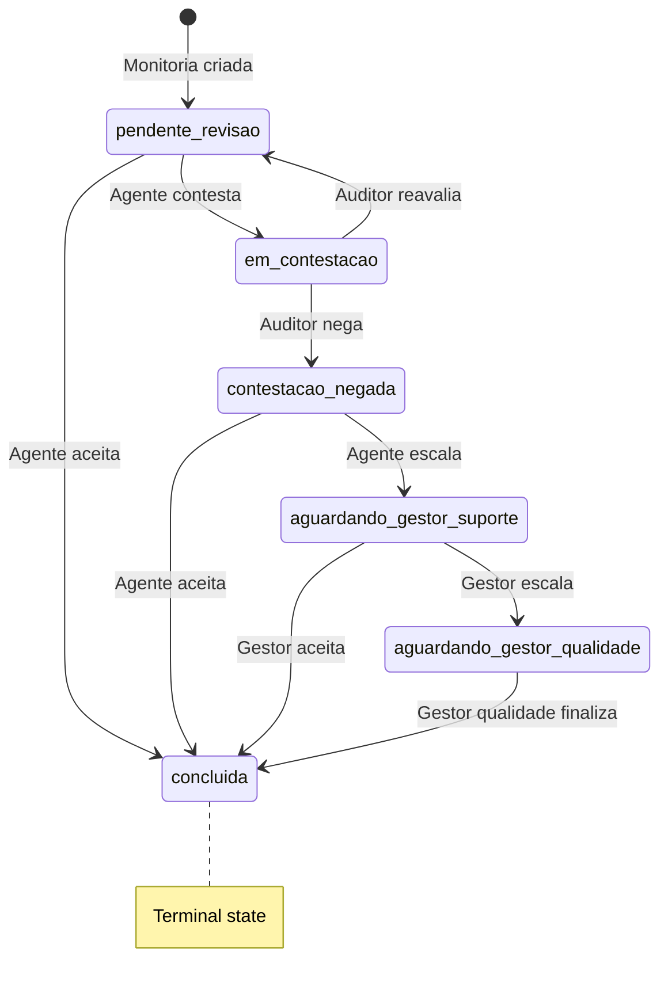

# SPEC: Módulo de Monitorias

## Arquivos Envolvidos
- `src/components/MonitoriaForm.tsx` — Formulário de criação/reavaliação (684 linhas)
- `src/components/MonitoriaList.tsx` — Lista com ações e filtros (676 linhas)
- `src/components/ui/ActionDeadlineClock.tsx` — Widget de contagem regressiva
- `src/lib/businessHours.ts` — Cálculo de prazos de ação
- `src/lib/useQualityConfig.tsx` — Context Provider + hook de configuração de prazos de ação e qualidade

## Modelo de Dados (`Monitoria`)

```typescript
interface Monitoria {
  id: string;
  ticket_id: string;          // ID do ticket avaliado
  evaluator_id: string;       // UUID do auditor (criador)
  evaluator_name: string;     // Nome do auditor
  evaluated_id: string;       // UUID do agente avaliado
  evaluated_name: string;     // Nome do agente
  team_id: string;            // UUID da equipe
  form_id: string;            // UUID do formulário usado
  form_name: string;          // Nome do formulário
  channel?: string;           // Canal (chat, telefone, email)
  score: number;              // Score final (0-100)
  answers: Record<string, any>; // Respostas por critério
  critical_errors?: string[]; // IDs dos erros críticos marcados
  feedback?: string;          // Feedback do auditor
  status: MonitoriaStatus;    // Status atual
  history: HistoryEntry[];    // Audit trail
  action_deadline_at?: string; // Deadline ISO do prazo de ação
  created_at: string;
  updated_at: string;
  active: boolean;            // soft-delete
}
```

## Status e Transições



### Tabela de Transições

| Status Atual | Ação | Novo Status | Quem Faz |
|---|---|---|---|
| `pendente_revisao` | Aceitar | `concluida` | suporte |
| `pendente_revisao` | Contestar | `em_contestacao` | suporte |
| `em_contestacao` | Reavaliar | `pendente_revisao` | qualidade |
| `em_contestacao` | Negar | `contestacao_negada` | qualidade |
| `contestacao_negada` | Aceitar | `concluida` | suporte |
| `contestacao_negada` | Escalar p/ Gestor | `aguardando_gestor_suporte` | suporte |
| `aguardando_gestor_suporte` | Aceitar | `concluida` | gestor_suporte |
| `aguardando_gestor_suporte` | Escalar p/ Qualidade | `aguardando_gestor_qualidade` | gestor_suporte |
| `aguardando_gestor_qualidade` | Finalizar | `concluida` | gestor_qualidade |
| Qualquer (prazo vencido) | Auto-finalizar | `concluida` | sistema (cron) |

## Formulário Multi-Step (MonitoriaForm)

### Step 1 — Dados Básicos
- Ticket ID, Agente (select), Equipe (select), Canal, Formulário
- **Lógica Agente↔Equipe** (vinculação protegida):
  - Selecionar Agente → filtra equipes vinculadas ao agente; equipe permanece "Selecione a equipe"
  - Selecionar Equipe → filtra agentes vinculados à equipe; agente permanece "Selecione o agente"
  - Com ambos selecionados, a lista do outro campo é filtrada pelo relacionamento
  - Tentar trocar Agente com Equipe incompatível selecionada → bloqueio + toast informativo
  - Tentar trocar Equipe com Agente incompatível selecionado → bloqueio + toast informativo
  - O usuário deve primeiro desselecionar (placeholder) para alterar o relacionamento
- **CustomSelect com type-ahead**: Ao abrir qualquer dropdown, o usuário pode digitar para filtrar opções em tempo real (case-insensitive), sem campo de busca visível

### Step 2 — Avaliação por Pilar
- Para cada pilar do formulário:
  - Título e peso do pilar
  - Lista de critérios (checkbox: Sim/Não/N.A.)
  - Erros críticos (toggle)
- Score parcial exibido em tempo real

### Step 3 — Resumo
- Score calculado, resumo de respostas, campo de feedback textual

### Step 4 — Confirmação
- Revisão final antes de salvar

## Cálculo de Score

```
Para cada pilar:
  pontos_obtidos = count(criterios marcados como "sim")
  pontos_possiveis = count(criterios) - count(criterios N/A)
  
  se pontos_possiveis > 0:
    score_pilar = pontos_obtidos / pontos_possiveis
  senão:
    score_pilar = 1.0 (pilar ignorado)

Score Final = Σ(score_pilar × peso_pilar) / Σ(peso_pilar) × 100

Se qualquer erro_critico marcado → Score Final = 0
```

## Contestação e Reavaliação

1. Agente contesta com justificativa textual
2. Auditor original recebe a contestação
3. Auditor pode **reavaliar** (abre MonitoriaForm em modo reavaliação):
   - Formulário pré-preenchido com respostas anteriores
   - Pode alterar critérios e recalcular score
   - Histórico mostra score anterior vs. novo
4. Ou auditor pode **negar** a contestação
5. Se negada, agente pode **escalar** para gestor de suporte
6. Gestor pode aceitar ou **escalar** para gestor de qualidade

## Prazo de Ação / Deadlines

- Cada transição de status recalcula o deadline
- Prazo calculado com `addBusinessHours()` de `businessHours.ts`
- Configurável via `useQualityConfig` (horas por etapa)
- `ActionDeadlineClock` exibe contagem regressiva em tempo real (atualiza a cada minuto)
- Cores do relógio: verde (>50% restante), amarelo (25-50%), vermelho (<25%)
- Expiração → cron job `process_sla_timeouts()` finaliza automaticamente

## Anonimização

Agentes (`role=suporte`) veem:
- `evaluator_name` → "Equipe de Qualidade" (nome real ocultado)
- Não veem ID do auditor individual
- Garantido no frontend via renderização condicional
