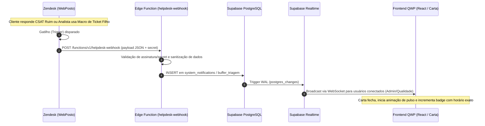

# Especificação Técnica: Central de Notificações, Padrões Visuais e Arquitetura de Webhooks (Opção B)

## 1. Visão Geral
A Central de Notificações do QualidadeWP (QWP) provê uma interface não intrusiva de acompanhamento em tempo real para eventos operacionais críticos, incluindo contestações de auditoria, chamados disponíveis na fila de triagem (CSAT Negativas e Chamados Filhos) e integridade dos serviços integrados.

---

## 2. Padrão Visual e Comportamento da UI (Design System)

### 2.1. O Ícone da Carta (Envelope Postal)
O ícone segue a linguagem vetorial limpa do sistema (sem preenchimentos sólidos brancos, traçado vazado `fill="none"` e `stroke="currentColor"`):

* **Carta Fechada com Animação (`Mail`)**:
  * **Quando ocorre**: Sempre que houver 1 ou mais notificações não lidas (`unreadNotificationsCount > 0`).
  * **Animação contínua**: Pulso sutil de escala (`scale: [1, 1.14, 1]`) e leve balanço angular (`rotate: [0, -6, 6, 0]`) a cada 2.2s.
  * **Destaque visual**: Botão com fundo da cor primária/destaque (`bg-brand-highlight text-white`) e badge numérico vermelho com contador no canto superior direito.
* **Carta Aberta Estática (`MailOpen`)**:
  * **Quando ocorre**: Quando o usuário clica em *"Marcar lidas"* ou não há pendências (`unreadNotificationsCount === 0`).
  * **Visual**: Ícone de envelope aberto estático, fundo neutro (`bg-surface-card border-surface-border`), sem animação contínua.

### 2.2. Popover de Histórico e Exibição de Horários
Ao clicar na carta, o painel suspenso exibe:
* **Cabeçalho**: Título, contador de pendências e botão rápido *"Marcar lidas"*.
* **Listagem de Eventos**: Cards com ícone temático, título em negrito, mensagem resumida e **badge com ícone de relógio contendo a hora exata** (`dd/MM às HH:mm` ou `Hoje às HH:mm`).
* **Interatividade**: Clicar em uma notificação marca o item como lido e redireciona automaticamente o usuário para a aba correspondente (`monitorias` ou `filas`).

---

## 3. Matriz de Perfis e Lógica de Exibição (RBAC)

| ID | Notificação | Quem Recebe | Condição / Gatilho | Redirecionamento |
|---|---|---|---|---|
| `contested-{id}` | **Contestação em Análise** | `suporte` | O analista logado possui monitoria com status `contestado` aguardando reavaliação da Qualidade. | Aba **Monitorias** |
| `eval-{id}` | **Nova Avaliação Disponível** | `suporte` | Uma nova monitoria foi publicada para o analista logado. Exibe nota e número do chamado. | Aba **Monitorias** |
| `admin-contest-{n}` | **Contestação(ões) Pendente(s)** | `qualidade`, `gestor_qualidade`, `admin` | Existem monitorias contestadas no sistema que necessitam de parecer da Qualidade. | Aba **Monitorias** |
| `queue-csat-negativas` | **Fila de Triagem Atualizada** | `qualidade`, `gestor_qualidade`, `admin` | Novos chamados com CSAT Ruim ou Chamados Filhos aguardando triagem/auditoria com IA. | Aba **Filas** |
| `system-status-ok` | **Sistema QualiTrack Conectado** | **Exclusivo `admin`** | Confirmação de integridade da API Zendesk e IA Gemini sincronizadas. **Oculto para suporte e qualidade.** | Popover Informativo |

---

## 4. Arquitetura de Integração em Tempo Real: Opção B (Webhooks do Zendesk)

A Opção B (Gatilhos orientados a eventos via Webhook) foi a estratégia selecionada por eliminar consultas ociosas (polling), economizar cota de API do Zendesk e garantir notificação instantânea.

### 4.1. Configuração no Zendesk Admin Center
1. **Destino do Webhook**:
   * **URL**: `https://vpytvgpsqdapgouyjowc.supabase.co/functions/v1/helpdesk-webhook`
   * **Método**: `POST`
   * **Formato**: `JSON`
   * **Autenticação**: Header personalizado `x-qualitrack-webhook-token: {{CHAVE_SECRETA}}`
2. **Gatilho de CSAT Negativo**:
   * **Condição**: `Ticket > Classificação de satisfação` mudou para `Ruim` ou `Ruim com comentário`.
   * **Ação**: Notificar Webhook QualiTrack com JSON contendo `ticket.id`, `ticket.subject`, `satisfaction.score`, `ticket.assignee.name`, `ticket.group.name`, `timestamp`.
3. **Gatilho de Chamado Filho**:
   * **Condição**: `Ticket: Tipo de problema` ou `Ticket: Tags` contém `existe_ticket_filho` ou macros de encaminhamento para análise técnica.
   * **Ação**: Notificar Webhook QualiTrack com categoria do chamado filho e ID do ticket pai.

### 4.2. Segurança e Resiliência
* **Proteção contra ataques de replay e spoofing**: A Edge Function rejeita qualquer requisição que não contenha o token secreto compartilhado configurado nas variáveis de ambiente (`HELPDESK_WEBHOOK_SECRET`).
* **Tratamento de duplicatas**: Cada evento grava com chave idempotente baseada no `ticket_id + timestamp`.
* **Fallback**: Caso o WebSocket do Realtime sofra oscilação momentânea de conexão, o sistema realiza um sync automático ao restabelecer conexão (`navigator.onLine` / reconexão do Supabase).
